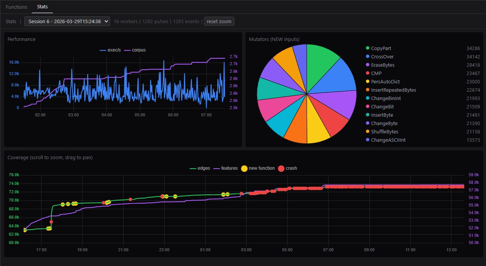

<div id="toc">
  <ul align="center" style="list-style: none">
    <summary align="center">
    <h1> apatchy </h1>
    </summary>
    <i>An in-process fuzzing framework for Apache HTTPD</i>
  </ul>
  <ul align="center">
    <a href='https://pwner.gg/apatchy/'>
    
     
    </a>
  </ul>
</div>

apatchy lets you fuzz Apache's full HTTP request processing pipeline - parsing, hooks, filters, handlers - without any network I/O. It replaces Apache's socket layer with custom I/O filters, feeding raw bytes directly into the same code paths that handle real HTTP traffic.

## Features

* Manage different build-trees & configurations 
* Coverage reports generation
* Custom Introspection: LLVM Call-tree Analysis
* Manager for: Harness, Proto Mutators
* Triage bugs / re-play payloads
* Profiling (kcachegrind/qcachegrind) to analyze bottlenecks in your harness logic to get better perf.
* Custom toolchain to verify depndencies 
* Compatability with older Apache versions
* 1day re-production system
* and more :D 



## Quick Start

Recommended to run this on WSL2 and/or docker container

```bash
docker build --build-arg UID=$(id -u) -t apatchy-dev .
docker run -it --rm -p 9000:9000 -v $(pwd):/repo apatchy-dev
```

then run these commands in this order:
```bash
# 1. activate environment
cd framework/
uv venv .venv
uv pip install --python .venv -e ".[all]"
source .venv/bin/activate

# 2. init setup (one-time setup)
apatchy setup check                            # verify dependencies
apatchy setup --force llvm --llvm-version 18   # install LLVM tools locally

# 3. download
apatchy download --version 2.4.65

# 4. configure 
apatchy configure --asan --ubsan --ubsan-ignorelist ./configs/ubsan.ignorelist

# 5. make (`--bear` for IDE navigation)
apatchy make --bear

# 6. setup for protobuf
apatchy setup lpm

# 7. list avail. harnesses
apatchy harness list

# 8. link target harness
apatchy link libfuzzer --harness mod_fuzzy_proto_session --bear

# 9. fuzz
apatchy fuzz     \
    --engine libfuzzer     \
    --config configs/session-coverage.conf     \
    --seed-dir /tmp/htdocs/

# 10. Generate HTML cov report
apatchy coverage report \
    --with-introspect \
    --config configs/session-coverage.conf \
    --jobs 8 \
    --harness mod_fuzzy_proto_session

# 11. Launch interactive gui w/ call-tree analysis 
apatchy introspect \
    --entry session_crypto_decode,session_crypto_encode,session_crypto_init
```

## Documentation

>Note: **This is still in progress**/not complete. I know the CLI needs more attention.

* The documentation is live at https://pwner.gg/apatchy/
* You can generate it locally via `apatchy docs --serve`

## License

See [LICENSE](LICENSE).
