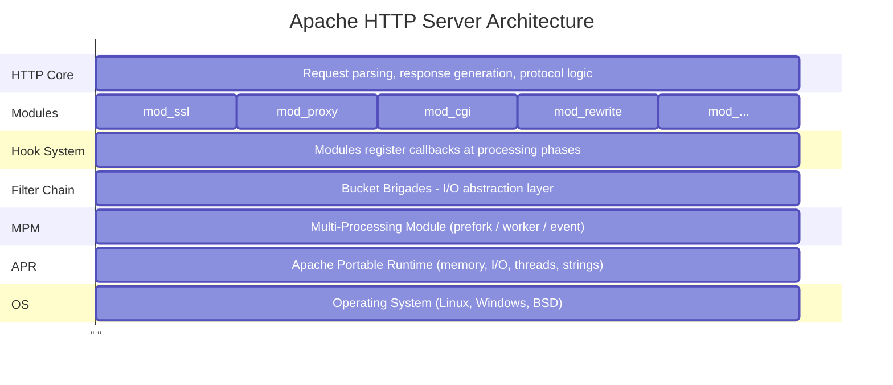

# Chapter 1: Introduction to Apache Architecture

## What is Apache HTTP Server?

Apache HTTP Server (commonly called "Apache" or "httpd") is the world's most widely used web server software. Unlike simpler web servers, Apache is designed as a highly modular, extensible system that can be customized for virtually any use case.

For a C/Linux developer approaching Apache for the first time, think of it as a **framework** rather than a monolithic application. The core is relatively small - most functionality lives in modules that plug into a well-defined architecture.

## High-Level Architecture Overview



## The Key Abstractions

Apache's architecture is built on several key abstractions. Understanding these is crucial before diving into the code:

### 1. APR (Apache Portable Runtime)
The foundation layer. APR provides cross-platform APIs for:
- Memory management (pools)
- File I/O
- Network sockets
- Threading and process management
- Hash tables, arrays, strings

**Why it matters**: You'll never see raw `malloc()` or `socket()` calls in Apache code. Everything goes through APR.

### 2. Pools (Memory Management)
Apache uses a hierarchical pool-based memory allocator. Instead of manually tracking every allocation, you allocate from a pool, and when the pool is destroyed, everything allocated from it is freed automatically.

```c
// Instead of:
char *buf = malloc(1024);
// ... use buf ...
free(buf);  // Easy to forget!

// Apache uses:
char *buf = apr_palloc(pool, 1024);
// ... use buf ...
// Automatically freed when pool is destroyed
```

### 3. Modules
Everything in Apache is a module. Even core functionality like HTTP protocol handling is implemented as modules. A module is a struct that declares:
- What hooks it wants to register callbacks for
- What configuration directives it provides
- What filters it implements

### 4. Hooks
Hooks are the extension points in Apache's request processing. At various phases, Apache calls all modules that registered for that hook. For example:
- {httpd}`ap_hook_handler` - Called to generate response content
- {httpd}`ap_hook_access_checker` - Called to check access permissions
- {httpd}`ap_hook_translate_name` - Called to map URL to filesystem

### 5. Filters and Bucket Brigades
All I/O in Apache flows through filters arranged in chains. Data is passed between filters as "bucket brigades" - linked lists of data chunks. This allows:
- <a href="/doxygen/mod__ssl_8c_source.html">mod_ssl.c</a> to transparently encrypt/decrypt
- <a href="/doxygen/mod__deflate_8c_source.html">mod_deflate.c</a> to compress responses
- Custom modules to transform content

### 6. MPM (Multi-Processing Module)
The MPM controls how Apache handles concurrency:
- **prefork**: One process per connection (safe, but heavy)
- **worker**: Multiple threads per process
- **event**: Async I/O with thread pool (most efficient)

Only one MPM is active at a time.

## Source Code Organization

When you look at the Apache source tree, here's what you'll find:

```
httpd-2.4.x/
├── server/           # Core server code
│   ├── main.c        # Entry point
│   ├── config.c      # Configuration parsing
│   ├── core.c        # Core module
│   ├── request.c     # Request processing
│   ├── protocol.c    # HTTP protocol handling
│   └── ...
├── modules/          # All modules organized by category
│   ├── aaa/          # Authentication/Authorization
│   ├── filters/      # Content filters
│   ├── generators/   # Content generators (CGI, etc.)
│   ├── http/         # HTTP protocol modules
│   ├── loggers/      # Logging modules
│   ├── mappers/      # URL mapping modules
│   ├── proxy/        # Proxy functionality
│   ├── ssl/          # SSL/TLS support
│   └── ...
├── include/          # Public headers
│   ├── httpd.h       # Main definitions
│   ├── http_config.h # Configuration API
│   ├── http_core.h   # Core module API
│   ├── http_protocol.h
│   ├── http_request.h
│   ├── ap_*.h        # Various APIs
│   └── ...
├── srclib/           # Bundled libraries
│   ├── apr/          # Apache Portable Runtime
│   └── apr-util/     # APR utilities
├── os/               # OS-specific code
└── support/          # Helper utilities
```

## Key Data Structures

Before reading Apache code, familiarize yourself with these fundamental structures:

### {httpd}`server_rec` - Server Configuration
Represents a virtual host. Contains all configuration for a server context.

```c
struct server_rec {
    const char *defn_name;      // Config file where defined
    const char *server_hostname; // ServerName
    apr_port_t port;            // Port number
    /* ... many more fields ... */
};
```

### {httpd}`conn_rec` - Connection
Represents a client connection. Lives for the duration of a TCP connection (may serve multiple requests with keep-alive).

```c
struct conn_rec {
    apr_pool_t *pool;           // Connection pool
    server_rec *base_server;    // Virtual host
    void *conn_config;          // Per-connection module configs
    apr_socket_t *client_socket; // The actual socket
    const char *client_ip;      // Client IP address
    /* ... */
};
```

### {httpd}`request_rec` - HTTP Request
The central structure. Contains everything about a single HTTP request/response.

```c
struct request_rec {
    apr_pool_t *pool;           // Request pool (freed after response)
    conn_rec *connection;       // Parent connection
    server_rec *server;         // Server handling this request

    // Request info
    const char *the_request;    // First line of request
    char *method;               // GET, POST, etc.
    char *uri;                  // Request URI
    char *filename;             // Translated to filesystem path

    // Headers
    apr_table_t *headers_in;    // Request headers
    apr_table_t *headers_out;   // Response headers

    // Response info
    int status;                 // HTTP status code
    const char *content_type;   // Response Content-Type

    // Module configurations
    void *per_dir_config;       // Per-directory config vector
    void *request_config;       // Per-request module data

    /* ... many more fields ... */
};
```

## The Request Lifecycle (Preview)

When a request arrives, Apache processes it through distinct phases:

1. **Connection accepted** - MPM accepts TCP connection
2. **pre_connection hooks** - Modules can set up connection-level state
3. **Read request** - HTTP request line and headers parsed
4. **Post-read-request hooks** - First chance to examine request
5. **URI translation** - Map URI to handler/filename
6. **Access checking** - IP-based access control
7. **Authentication** - Who is the user?
8. **Authorization** - Is user allowed?
9. **MIME type checking** - Determine content type
10. **Fixups** - Last chance to modify before handling
11. **Handler** - Generate response content
12. **Logging** - Record what happened
13. **Cleanup** - Free request resources

Each phase has associated hooks where modules can participate.

## Building Apache from Source

For development and fuzzing, you'll want to build Apache from source:

```bash
# In the httpd source directory
./configure --prefix=/path/to/install \
            --enable-modules=most \
            --enable-static-support \
            --with-included-apr

make
make install
```

Key configure options:
- `--enable-modules=most` - Build most modules
- `--enable-static-support` - Build modules statically (easier for fuzzing)
- `--with-included-apr` - Use bundled APR instead of system

## What's Next

In the following chapters, we'll dive deep into each component:

- **Chapter 2**: APR - The foundation library
- **Chapter 3**: Memory pools - Apache's memory management
- **Chapter 4**: Configuration system
- **Chapter 5**: MPM - Process/thread models
- **Chapter 6**: Hook system - Extending Apache
- **Chapter 7**: Filters and bucket brigades
- **Chapter 8**: Request processing pipeline
- **Chapter 9**: Module anatomy - Writing your own
- **Chapter 10**: Building and linking
- **Chapter 11**: Fuzzing Apache

Each chapter builds on the previous, and by the end, you'll understand Apache well enough to build a fuzzing harness that exercises the entire request processing pipeline.
