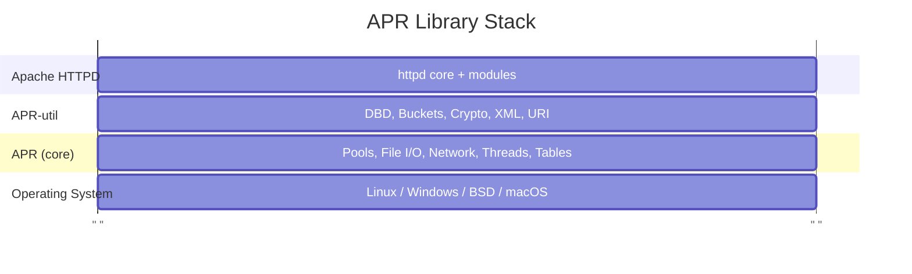
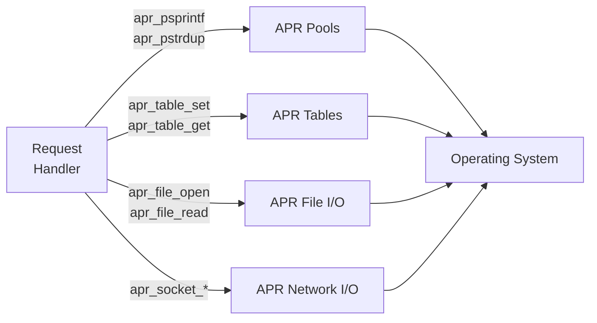

# Chapter 2: APR - Apache Portable Runtime

## What is APR?

APR (Apache Portable Runtime) is a C library that provides a consistent, cross-platform interface to underlying OS functionality. Think of it as Apache's "standard library" that abstracts away differences between Linux, Windows, BSD, and other operating systems.

```{note}
If you're reading Apache code and see a function starting with `apr_`, it's an APR function. You'll almost never see raw POSIX or Win32 calls in Apache modules.
```

## Why APR Exists

Consider the problem of writing portable C code:

```c
// Linux/POSIX:
#include <unistd.h>
#include <sys/socket.h>
int fd = socket(AF_INET, SOCK_STREAM, 0);

// Windows:
#include <winsock2.h>
SOCKET s = socket(AF_INET, SOCK_STREAM, 0);
// Plus: WSAStartup(), different error handling, etc.
```

With APR:
```c
#include "apr_network_io.h"
apr_socket_t *sock;
apr_socket_create(&sock, APR_INET, SOCK_STREAM, APR_PROTO_TCP, pool);
// Works identically on all platforms
```

APR doesn't just wrap system calls - it normalizes error codes, resource lifecycle (everything ties into pools), and calling conventions across platforms. Every APR function takes a pool parameter, which means every APR-allocated resource is automatically cleaned up when the pool is destroyed. This is a fundamental design choice that pervades all of Apache.

## APR vs APR-util

APR is split into two libraries. APR-core provides the low-level OS abstractions, and APR-util adds higher-level data structures and services on top:



### APR (core)
- Memory pools (the foundation - see [Chapter 3](03-memory-pools.md))
- File I/O
- Network I/O
- Process/thread management
- Atomic operations
- Time functions
- Environment variables

### APR-util
- Database abstraction (DBD)
- Bucket brigades (the I/O abstraction for Apache filters - see [Chapter 7](07-filters-buckets.md))
- Cryptographic functions (used by mod_session_crypto)
- URI/URL handling
- XML parsing
- Queue/reslist (resource pools)
- Memcache client

In the source tree:
```
srclib/
├── apr/          # Core APR
│   ├── include/  # apr_*.h headers
│   └── ...
└── apr-util/     # APR utilities
    ├── include/  # apu_*.h headers
    └── ...
```

```{note}
**Fuzzing note**: When building Apache for fuzzing, both libraries are compiled from source using `-with-included-apr`. This ensures APR is instrumented with the same compiler flags (sanitizers, coverage) as Apache itself. Using system-installed APR would mean APR code is uninstrumented, hiding bugs that occur inside APR functions.
```

## APR Naming Conventions

APR follows consistent naming patterns that make Apache code readable once you know the system:

```c
// Types end with _t
apr_pool_t      // Memory pool
apr_socket_t    // Network socket
apr_file_t      // File handle
apr_thread_t    // Thread handle
apr_table_t     // Key-value table

// Functions are apr_<module>_<action>
apr_pool_create()
apr_socket_create()
apr_file_open()
apr_thread_create()
apr_table_get()

// Return status
apr_status_t    // Return type for most functions
APR_SUCCESS     // Success constant (usually 0)
APR_EOF         // End of file
APR_EAGAIN      // Try again (non-blocking)
```

This pattern extends to Apache's own API layer, which uses `ap_` for server functions and `AP_` for constants:

```c
ap_hook_handler()        // Register a handler hook
ap_run_handler()         // Run all registered handlers
ap_get_module_config()   // Get module config from a vector
AP_INIT_TAKE1            // Directive that takes one argument
```

## Essential APR Types and Functions

````{dropdown} Status Handling
:open:

Almost all APR functions return {httpd}`apr_status_t`. This is a consistent error-handling pattern - check the return value, and use {httpd}`apr_strerror` to translate error codes to human-readable messages:

```c
apr_status_t rv;

rv = apr_file_open(&fp, "/path/to/file", APR_READ, APR_OS_DEFAULT, pool);
if (rv != APR_SUCCESS) {
    char errbuf[256];
    apr_strerror(rv, errbuf, sizeof(errbuf));
    // Handle error
}
```

Common status values:
```c
APR_SUCCESS     // Operation succeeded
APR_ENOENT      // File not found
APR_EACCES      // Permission denied
APR_EAGAIN      // Resource temporarily unavailable
APR_EOF         // End of file/stream
APR_EINVAL      // Invalid argument
APR_ENOMEM      // Out of memory
APR_TIMEUP      // Timeout expired
```
````

````{dropdown} Strings

APR provides pool-allocated string functions. The key difference from standard C string functions is that **you don't need to figure out buffer sizes or call `free()`** - the pool handles all of it:

```c
// String duplication (allocated from pool)
char *copy = apr_pstrdup(pool, "original string");

// String formatting (like sprintf, but pool-allocated)
char *msg = apr_psprintf(pool, "User %s logged in from %s", user, ip);

// String concatenation (NULL terminates the argument list)
char *full = apr_pstrcat(pool, "prefix", middle, "suffix", NULL);

// Case-insensitive comparison
if (apr_strnatcasecmp(str1, str2) == 0) {
    // Strings are equal (ignoring case)
}
```

The {httpd}`apr_pstrcat` pattern (NULL-terminated variadic arguments) is worth noting because it's a common source of bugs when the terminating `NULL` is forgotten. The function will keep reading arguments from the stack until it finds a NULL pointer, potentially reading garbage data.
````

````{dropdown} Arrays

Dynamic arrays that grow automatically. The API is slightly unusual - {httpd}`apr_array_push` returns a pointer to the *slot* where you write the element, rather than taking the element as a parameter:

```c
// Create an array of char* pointers
apr_array_header_t *arr = apr_array_make(pool, 10, sizeof(char*));

// Push elements (note: push returns a pointer to the slot)
*(char**)apr_array_push(arr) = "first";
*(char**)apr_array_push(arr) = "second";

// Access elements
char **elts = (char**)arr->elts;
for (int i = 0; i < arr->nelts; i++) {
    printf("%s\n", elts[i]);
}

// Concatenate arrays
apr_array_cat(arr1, arr2);  // Appends arr2 to arr1
```
````

````{dropdown} Tables

Key-value storage that maintains insertion order. This is the data structure behind {httpd}`r->headers_in <request_rec::headers_in>`, {httpd}`r->headers_out <request_rec::headers_out>`, and other HTTP header collections in Apache. The distinction between `set` (replace) and `add` (allow duplicates) is important because HTTP allows multiple headers with the same name:

```c
// Create a table
apr_table_t *headers = apr_table_make(pool, 10);

// Set values (replaces existing key)
apr_table_set(headers, "Content-Type", "text/html");
apr_table_set(headers, "Cache-Control", "no-cache");

// Add values (allows duplicates - important for Set-Cookie)
apr_table_add(headers, "Set-Cookie", "session=abc");
apr_table_add(headers, "Set-Cookie", "user=xyz");

// Get value (returns first match)
const char *ct = apr_table_get(headers, "Content-Type");

// Remove
apr_table_unset(headers, "Cache-Control");

// Iterate over all entries
apr_table_do(callback_fn, callback_data, headers, NULL);
// callback_fn signature: int (*)(void *data, const char *key, const char *val)
```
````

````{dropdown} Hash Tables

For when you need O(1) lookup by arbitrary key (not just strings). Apache uses hash tables for module configuration vectors, filter registrations, and other internal mappings:

```c
// Create hash table
apr_hash_t *ht = apr_hash_make(pool);

// Set value (key can be any bytes, APR_HASH_KEY_STRING for strings)
apr_hash_set(ht, "mykey", APR_HASH_KEY_STRING, myvalue);

// Get value
void *val = apr_hash_get(ht, "mykey", APR_HASH_KEY_STRING);

// Iterate
apr_hash_index_t *hi;
for (hi = apr_hash_first(pool, ht); hi; hi = apr_hash_next(hi)) {
    const void *key;
    void *val;
    apr_hash_this(hi, &key, NULL, &val);
}
```
````

````{dropdown} File I/O

```c
apr_file_t *fp;
apr_status_t rv;

// Open file
rv = apr_file_open(&fp, "/path/to/file",
                   APR_READ | APR_WRITE | APR_CREATE,
                   APR_FPROT_UREAD | APR_FPROT_UWRITE,
                   pool);

// Read
char buffer[1024];
apr_size_t nbytes = sizeof(buffer);
rv = apr_file_read(fp, buffer, &nbytes);
// nbytes is updated with actual bytes read

// Write
const char *data = "Hello, world!";
apr_size_t len = strlen(data);
rv = apr_file_write(fp, data, &len);

// Seek
apr_off_t offset = 0;
rv = apr_file_seek(fp, APR_SET, &offset);

// Close (optional - pool cleanup handles it automatically)
apr_file_close(fp);
```

File open flags:
```c
APR_READ        // Open for reading
APR_WRITE       // Open for writing
APR_CREATE      // Create if doesn't exist
APR_APPEND      // Append mode
APR_TRUNCATE    // Truncate existing file
APR_BINARY      // Binary mode (Windows)
APR_EXCL        // Error if exists (with CREATE)
APR_BUFFERED    // Enable buffering
APR_XTHREAD     // Allow cross-thread access
```
````

````{dropdown} Network I/O

The network I/O API is how Apache accepts connections and communicates with backends (for mod_proxy). Note the consistent pattern: every resource is tied to a pool:

```c
apr_socket_t *sock;
apr_sockaddr_t *addr;
apr_status_t rv;

// Create socket
rv = apr_socket_create(&sock, APR_INET, SOCK_STREAM, APR_PROTO_TCP, pool);

// Resolve hostname to address
rv = apr_sockaddr_info_get(&addr, "www.example.com", APR_INET, 80, 0, pool);

// Connect
rv = apr_socket_connect(sock, addr);

// Send data
const char *request = "GET / HTTP/1.0\r\n\r\n";
apr_size_t len = strlen(request);
rv = apr_socket_send(sock, request, &len);

// Receive data
char buffer[4096];
apr_size_t buflen = sizeof(buffer);
rv = apr_socket_recv(sock, buffer, &buflen);

// Set options
apr_socket_opt_set(sock, APR_SO_NONBLOCK, 1);       // Non-blocking
apr_socket_opt_set(sock, APR_SO_REUSEADDR, 1);      // Reuse address
apr_socket_timeout_set(sock, apr_time_from_sec(30)); // 30 second timeout
```

```{note}
**Fuzzing note**: The fuzzing harness replaces Apache's normal network I/O layer with custom input/output filters that read from a memory buffer instead of a socket. This means {httpd}`apr_socket_recv` is never called during fuzzing - the data flows through the filter chain instead.
```
````

````{dropdown} Process and Thread Management

```c
// Create a process
apr_proc_t proc;
apr_procattr_t *attr;

apr_procattr_create(&attr, pool);
apr_procattr_io_set(attr, APR_FULL_BLOCK, APR_FULL_BLOCK, APR_NO_PIPE);
apr_procattr_cmdtype_set(attr, APR_PROGRAM);

const char *args[] = { "/bin/ls", "-la", NULL };
apr_proc_create(&proc, "/bin/ls", args, NULL, attr, pool);

// Wait for process
int exitcode;
apr_exit_why_e why;
apr_proc_wait(&proc, &exitcode, &why, APR_WAIT);

// Create a thread
apr_thread_t *thread;
apr_threadattr_t *tattr;

apr_threadattr_create(&tattr, pool);
apr_thread_create(&thread, tattr, thread_func, thread_data, pool);

// Thread function signature
void* APR_THREAD_FUNC thread_func(apr_thread_t *thread, void *data) {
    // Do work
    return NULL;
}

// Wait for thread
apr_status_t thread_rv;
apr_thread_join(&thread_rv, thread);
```
````

````{dropdown} Mutexes and Synchronization

These are relevant when writing modules for the `worker` or `event` MPMs (see [Chapter 5](05-mpm.md)), where multiple threads process requests concurrently:

```c
// Thread mutex
apr_thread_mutex_t *mutex;
apr_thread_mutex_create(&mutex, APR_THREAD_MUTEX_DEFAULT, pool);
apr_thread_mutex_lock(mutex);
// Critical section
apr_thread_mutex_unlock(mutex);

// Read-write lock (multiple readers, exclusive writer)
apr_thread_rwlock_t *rwlock;
apr_thread_rwlock_create(&rwlock, pool);
apr_thread_rwlock_rdlock(rwlock);   // Read lock
apr_thread_rwlock_wrlock(rwlock);   // Write lock
apr_thread_rwlock_unlock(rwlock);

// Condition variable
apr_thread_cond_t *cond;
apr_thread_cond_create(&cond, pool);
apr_thread_cond_wait(cond, mutex);   // Wait
apr_thread_cond_signal(cond);        // Wake one
apr_thread_cond_broadcast(cond);     // Wake all
```
````

## APR in Apache Context

The following diagram shows how a typical module handler interacts with APR subsystems. Every arrow represents an APR function call, and every resource is allocated from the request pool:



In Apache code, you'll see APR used everywhere:

```c
static int example_handler(request_rec *r)
{
    // String operations use request pool
    char *greeting = apr_psprintf(r->pool, "Hello, %s!",
                                  r->useragent_ip);

    // Headers are apr_table_t
    apr_table_set(r->headers_out, "X-Custom-Header", "value");

    // File operations
    apr_file_t *fp;
    apr_file_open(&fp, r->filename, APR_READ, APR_OS_DEFAULT, r->pool);

    return OK;
}
```

Notice that every operation uses {httpd}`r->pool <request_rec::pool>`. This is the request pool - it's created when the request starts and destroyed when the response is sent. Everything allocated from it (the greeting string, the file handle) is automatically freed. The handler doesn't need a single `free()` call, and there are no possible memory leaks regardless of which error path is taken.

## Common APR Usage Patterns

### Pattern 1: Error Handling
```c
apr_status_t rv;
char errbuf[256];

rv = apr_socket_connect(sock, addr);
if (rv != APR_SUCCESS) {
    ap_log_error(APLOG_MARK, APLOG_ERR, rv, s,
                 "Failed to connect: %s",
                 apr_strerror(rv, errbuf, sizeof(errbuf)));
    return HTTP_SERVICE_UNAVAILABLE;
}
```

### Pattern 2: Pool-based Resource Management
```c
// Create a subpool for temporary allocations
apr_pool_t *subpool;
apr_pool_create(&subpool, r->pool);

// Do work with subpool
char *temp = apr_palloc(subpool, 10000);
process_data(temp);

// Clean up when done - frees everything allocated from subpool
apr_pool_destroy(subpool);
```

### Pattern 3: Iteration with APR
```c
// Iterate over table entries
const apr_array_header_t *tarr = apr_table_elts(table);
const apr_table_entry_t *telts = (const apr_table_entry_t*)tarr->elts;

for (int i = 0; i < tarr->nelts; i++) {
    printf("%s: %s\n", telts[i].key, telts[i].val);
}
```

## Finding APR Documentation

APR headers has useful inline comments. See:
- `srclib/apr/include/apr_*.h` - Core APR
- `srclib/apr-util/include/apr_*.h` - APR-util

Each header has comments explaining every function, its parameters, return values, and edge cases. When in doubt about an APR function's behavior, read the header :D 

## Summary

APR is Apache's foundation library providing:
- **Portability**: Same code works on Linux, Windows, BSD, etc.
- **Consistency**: Uniform error handling, naming conventions
- **Memory safety**: Pool-based allocation prevents leaks
- **Rich functionality**: Covers files, network, threads, data structures

Before writing any Apache code, become comfortable with:
- {httpd}`apr_pool_t` and memory pools (next chapter)
- {httpd}`apr_table_t` for headers
- {httpd}`apr_status_t` for error handling
- String functions: {httpd}`apr_pstrdup`, {httpd}`apr_psprintf`, {httpd}`apr_pstrcat`

The next chapter dives deeper into APR's most important feature: memory pools.
