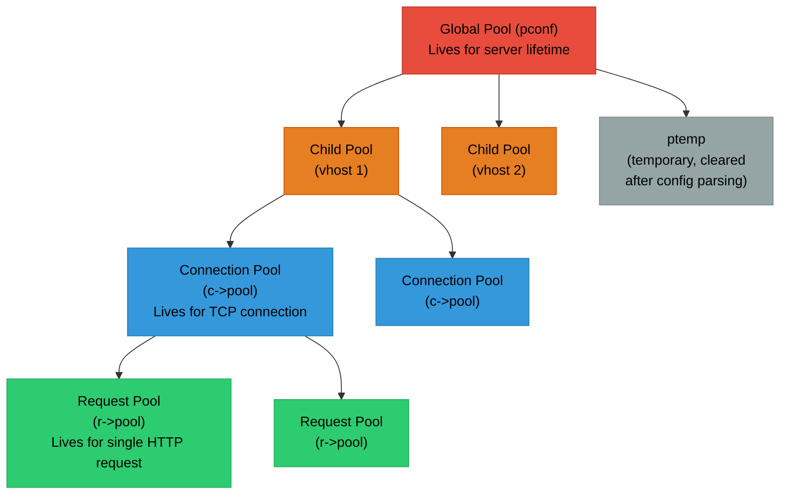
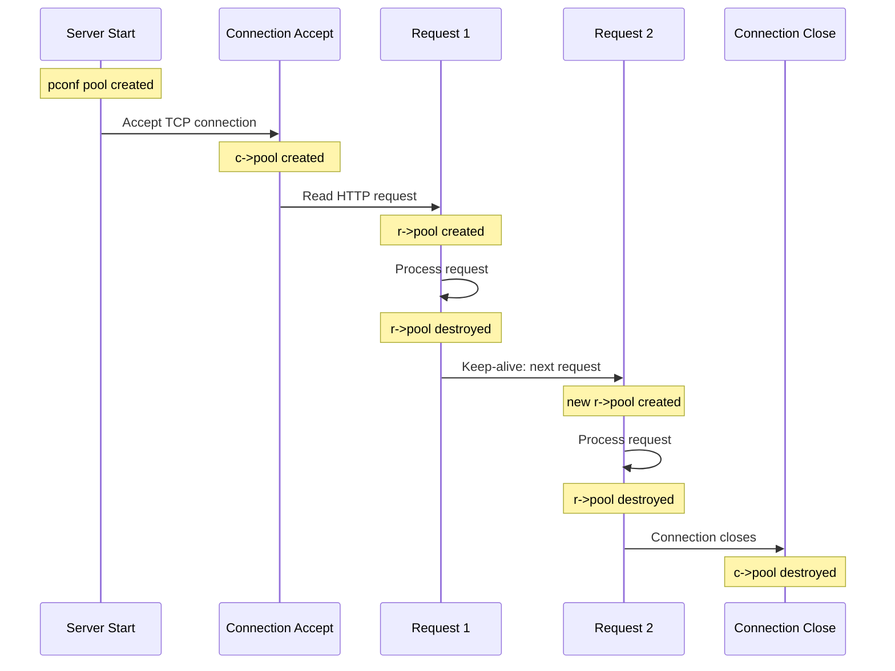
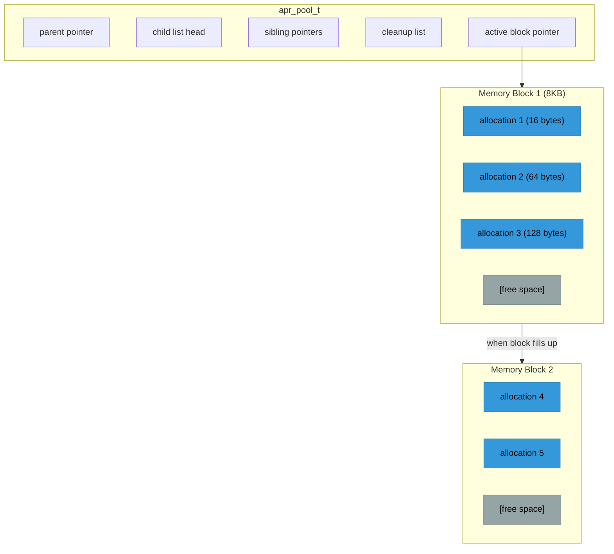

# Chapter 3: Memory Management and Pools

## The Problem with Traditional Memory Management

In traditional C programming, memory management is manual and error-prone:

```c
char *buffer = malloc(1024);
if (!buffer) return ERROR;

process_data(buffer);

// Oops! Forgot to free on this error path
if (some_error) {
    return ERROR;  // Memory leak!
}

free(buffer);
return OK;
```

Web servers make this especially dangerous because:
- Thousands of requests per second, each allocating many small objects
- Complex code paths with multiple return points create many opportunities to miss a `free()`
- Long-running processes amplify even tiny leaks into eventual OOM kills
- Multi-threaded access makes double-free and use-after-free bugs timing-dependent and hard to reproduce

## Apache's Solution: Memory Pools

Apache uses **hierarchical memory pools** (sometimes called "arenas"). The concept is simple:

1. Create a pool
2. Allocate from the pool (no individual frees needed)
3. Destroy the pool (everything allocated from it is freed at once)

```c
apr_pool_t *pool;
apr_pool_create(&pool, parent_pool);

char *buffer = apr_palloc(pool, 1024);
char *name = apr_pstrdup(pool, username);
char *msg = apr_psprintf(pool, "Hello, %s", name);

// All error paths are safe - just return
if (some_error) {
    return ERROR;  // No leak! Pool cleanup handles it
}

// When done, one call frees everything
apr_pool_destroy(pool);
```

The key insight: you never call `free()` on individual allocations. Instead, you tie allocations to a pool with a well-defined lifetime, and the pool frees everything when it's destroyed. This eliminates entire categories of bugs: memory leaks (the pool always cleans up), double-free (there's no `free()` to call twice), and dangling pointers (as long as you don't use pool memory after the pool is destroyed).

## Pool Hierarchy in Apache

Pools form a tree structure. When a parent pool is destroyed, all child pools are automatically destroyed too. Apache's pool hierarchy mirrors its request-processing architecture:



Each level in the hierarchy corresponds to a different scope in Apache's request processing:

- **Red (Global)**: Server-level pools survive the entire process lifetime
- **Orange (Virtual Host)**: Created per-virtual-host during configuration
- **Blue (Connection)**: Created when a TCP connection is accepted, destroyed when it closes (may span multiple keep-alive requests)
- **Green (Request)**: Created for each HTTP request, destroyed after the response is sent. This is by far the most frequently created/destroyed pool and is what most module code allocates from

## Apache's Standard Pools

### `pconf` - Configuration Pool
- Created at startup, destroyed on shutdown
- Used for: server configuration, loaded modules, directive strings
- Lifetime: Entire server process

### `plog` - Logging Pool
- Used for log file handles
- Lifetime: Until log rotation

### `ptemp` - Temporary Pool
- Destroyed after configuration parsing completes
- Used for: temporary allocations during config (expanding wildcard includes, building intermediate arrays)
- Lifetime: Configuration phase only

### Connection Pool (`c->pool`)
- Created when a connection is accepted
- Destroyed when the connection closes
- Lifetime: TCP connection (may span multiple requests with keep-alive)

### Request Pool (`r->pool`)
- Created for each HTTP request
- Destroyed after the response is sent and logging is complete
- Lifetime: Single request/response cycle
- **This is the pool you'll use most in module code**

The pool lifetime determines when memory is freed, which is why choosing the right pool matters:



## Pool API

````{dropdown} Creating and Destroying Pools

```c
#include "apr_pools.h"

apr_pool_t *pool;
apr_pool_t *parent;

// Create a pool with a parent
apr_status_t rv = apr_pool_create(&pool, parent);
if (rv != APR_SUCCESS) {
    // Handle error (rare - usually only on extreme memory pressure)
}

// Create a pool with debugging tag (helps identify pools in debug output)
apr_pool_create(&pool, parent);
apr_pool_tag(pool, "my_module_work_pool");

// Destroy pool (and all children recursively)
apr_pool_destroy(pool);

// Clear pool (free allocations but keep the pool structure alive)
apr_pool_clear(pool);
// Useful when you want to reuse a pool (e.g., in a loop)
```
````

````{dropdown} Allocating Memory

```c
// Basic allocation (like malloc, no initialization)
void *ptr = apr_palloc(pool, size);

// Zero-initialized allocation (like calloc)
void *ptr = apr_pcalloc(pool, size);

// There is NO apr_pfree() - memory is freed when pool is destroyed
```

The absence of `apr_pfree()` is intentional. Individual frees would defeat the purpose of pool allocation (bulk cleanup) and would require tracking metadata per allocation, adding overhead. If you need to free memory before the pool is destroyed, create a subpool and destroy that.
````

````{dropdown} String Functions

```c
// Duplicate a string
char *copy = apr_pstrdup(pool, "original");

// Duplicate with length limit
char *copy = apr_pstrndup(pool, source, max_len);

// Duplicate memory block
void *copy = apr_pmemdup(pool, source, len);

// Format string (sprintf to pool)
char *msg = apr_psprintf(pool, "Error %d: %s", code, desc);

// Concatenate strings (NULL-terminated argument list)
char *full = apr_pstrcat(pool, "Hello", " ", name, "!", NULL);
```
````

````{dropdown} Pool Cleanups

Cleanups are callbacks that run when a pool is destroyed. They're the mechanism for cleaning up non-memory resources (file handles, sockets, external library state) that are logically tied to a pool's lifetime:

```c
// Register a cleanup function
apr_pool_cleanup_register(pool,           // The pool
                          data,           // Data passed to callback
                          cleanup_func,   // Called on pool destroy
                          child_cleanup); // Called on child process (fork)

// Cleanup function signature
apr_status_t cleanup_func(void *data) {
    my_resource_t *res = data;
    close_resource(res);
    return APR_SUCCESS;
}

// For simple cases, use the null cleanup for the child function
apr_pool_cleanup_register(pool, data, cleanup_func,
                          apr_pool_cleanup_null);

// Kill (unregister) a cleanup
apr_pool_cleanup_kill(pool, data, cleanup_func);

// Run a cleanup immediately and unregister it
apr_pool_cleanup_run(pool, data, cleanup_func);
```

**Common cleanup patterns:**

```c
// File handle cleanup
static apr_status_t file_cleanup(void *data) {
    FILE *f = data;
    fclose(f);
    return APR_SUCCESS;
}

FILE *f = fopen("file.txt", "r");
apr_pool_cleanup_register(pool, f, file_cleanup, apr_pool_cleanup_null);
// Now f will be closed when pool is destroyed, regardless of error paths
```
````

## Real-World Examples from Apache

````{dropdown} Example 1: Request Handler

```c
static int my_handler(request_rec *r)
{
    // All allocations use r->pool - freed after response
    char *filename = apr_pstrcat(r->pool, r->document_root,
                                 r->uri, NULL);

    apr_finfo_t finfo;
    if (apr_stat(&finfo, filename, APR_FINFO_SIZE, r->pool) != APR_SUCCESS) {
        return HTTP_NOT_FOUND;
    }

    char *content = apr_palloc(r->pool, finfo.size + 1);
    // Read file...

    ap_rprintf(r, "%s", content);
    return OK;

    // No cleanup needed - r->pool handles everything
}
```
````

````{dropdown} Example 2: Connection Initialization

```c
static int my_pre_connection(conn_rec *c, void *csd)
{
    // Allocate per-connection state from connection pool
    my_conn_state_t *state = apr_pcalloc(c->pool, sizeof(*state));
    state->request_count = 0;
    state->bytes_transferred = 0;

    // Store in connection config
    ap_set_module_config(c->conn_config, &my_module, state);

    // state lives until connection closes
    return OK;
}
```
````

````{dropdown} Example 3: Configuration Directive

```c
static const char *set_my_option(cmd_parms *cmd, void *cfg, const char *arg)
{
    my_config_t *conf = cfg;

    // cmd->pool is the configuration pool - lives for server lifetime
    conf->value = apr_pstrdup(cmd->pool, arg);

    return NULL;  // NULL means success
}
```
````

## Subpools for Temporary Work

When you need to do work that generates many temporary allocations inside a loop, allocating from the request pool would cause memory to grow unboundedly until the request finishes. The solution is to create a subpool and clear it each iteration:

```c
static int process_large_data(request_rec *r, apr_array_header_t *items)
{
    // Create a subpool for temporary work
    apr_pool_t *tmp_pool;
    apr_pool_create(&tmp_pool, r->pool);

    for (int i = 0; i < items->nelts; i++) {
        // Heavy allocations in subpool
        char *expanded = expand_item(tmp_pool, items[i]);
        process_item(r, expanded);

        // Clear subpool each iteration to prevent buildup
        apr_pool_clear(tmp_pool);
    }

    apr_pool_destroy(tmp_pool);
    return OK;
}
```

Without the subpool, 10,000 iterations of {httpd}`apr_psprintf` would leave 10,000 temporary strings allocated in the request pool. With the subpool, only one iteration's worth of memory is live at any time.

## Pool Debugging and Fuzzing

APR has a built-in debug mode that fundamentally changes how pools allocate memory. This is critically important for fuzzing.
<!-- TODO: when we finish writing the document we will link it -->
<!-- [ASan and Custom Heap Allocators guide](../guides/asan-heap-considerations.md) -->

The short version: normally, {httpd}`apr_palloc` carves sub-allocations out of a large slab (typically 8KB). ASan only tracks the slab boundaries, not the sub-allocation boundaries, so small overflows between sub-allocations are invisible. When you configure with `--enable-pool-debug=yes`, every {httpd}`apr_palloc` becomes a direct `malloc()`, and every {httpd}`apr_pool_destroy` becomes a direct `free()`. ASan can then see every allocation boundary.

```c
// Tag pools for debugging - helps identify them in debug output
apr_pool_tag(pool, "my_module_request_pool");
```

Common pool-related bugs and how pools prevent them:

| Traditional Bug | With Pools |
|----------------|------------|
| Memory leak (forgot free) | Very unlikely - pool handles it |
| Double free | Very unlikely - no individual free |
| Use after free | Rare - usually obvious lifetime |
| Fragmentation | Minimized - pools allocate in chunks |

## How Pool Allocation Actually Works

Understanding the internal allocation strategy helps explain why ASan needs special configuration. Pools use a bump-pointer allocator within fixed-size memory blocks:



Each allocation just increments a pointer within the current block - O(1) and extremely fast, much cheaper than `malloc()`. When a block fills, a new one is allocated. On pool destroy/clear, all blocks are freed at once. There's no per-allocation metadata overhead, no free-list management, and no fragmentation within a pool.

## Best Practices

````{dropdown} 1. Choose the Right Pool

```c
// Per-request data: use r->pool
char *temp = apr_palloc(r->pool, size);

// Per-connection data: use c->pool
state = apr_palloc(c->pool, sizeof(*state));

// Server configuration: use cmd->pool
conf = apr_palloc(cmd->pool, sizeof(*conf));

// Temporary work: create a subpool
apr_pool_create(&tmp, r->pool);
```
````

````{dropdown} 2. Don't Over-Allocate

Pools are efficient, but not magic:

```c
// BAD: Huge allocation for small data
char *small = apr_palloc(r->pool, 1000000);  // 1MB for 10 bytes?

// GOOD: Right-sized allocation
char *small = apr_palloc(r->pool, strlen(source) + 1);
```
````

````{dropdown} 3. Use Subpools for Loops

```c
// BAD: Memory grows with each iteration
for (int i = 0; i < 10000; i++) {
    char *tmp = apr_psprintf(r->pool, "item %d", i);  // Leak!
}

// GOOD: Subpool prevents growth
apr_pool_t *iter_pool;
apr_pool_create(&iter_pool, r->pool);
for (int i = 0; i < 10000; i++) {
    char *tmp = apr_psprintf(iter_pool, "item %d", i);
    process(tmp);
    apr_pool_clear(iter_pool);  // Reuse memory
}
apr_pool_destroy(iter_pool);
```
````

````{dropdown} 4. Register Cleanups for Non-Pool Resources

```c
// Opening a native file descriptor
int fd = open("/path/to/file", O_RDONLY);

// Register cleanup so it's closed when pool dies
int *fd_ptr = apr_palloc(r->pool, sizeof(int));
*fd_ptr = fd;
apr_pool_cleanup_register(r->pool, fd_ptr, fd_cleanup, apr_pool_cleanup_null);
```
````

## Summary

Memory pools are fundamental to Apache:

- **No memory leaks**: Pool destruction frees everything
- **Simple code**: No tracking individual allocations
- **Fast**: Bump-pointer allocation is O(1)
- **Hierarchical**: Child pools auto-destroyed with parent
- **Cleanups**: Handle non-memory resources

Key points:
- Use {httpd}`request_rec::pool` for request-scoped allocations
- Use {httpd}`conn_rec::pool` for connection-scoped allocations
- Create subpools for temporary/loop work
- Register cleanups for external resources
- Never call `free()` on pool-allocated memory
- For fuzzing with ASan, use `--enable-pool-debug=yes` to make sub-allocation boundaries visible

This pool system is what makes Apache's modular architecture practical - modules don't need to carefully track memory because the framework handles it through pool lifetimes.

The next chapter covers Apache's configuration system - how `httpd.conf` directives are parsed, stored (in pool-allocated memory), and used by modules. good luck! :^)
