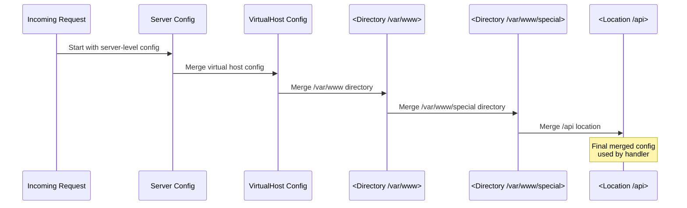

# Chapter 4: The Configuration System

## How Apache Configuration Works

Apache's configuration system is one of its most powerful features. The familiar `httpd.conf` syntax is processed by a sophisticated system that:

1. Parses configuration files
2. Calls modules to handle directives they registered
3. Builds configuration structures at multiple scopes
4. Merges configurations from different contexts

## Configuration Contexts

Apache configuration operates at multiple nesting levels. Each level can override settings from the level above:

```
┌─────────────────────────────────────────────────────────────────┐
│                    Server (Global) Context                      │
│  ServerRoot, Listen, LoadModule, ErrorLog                       │
│  ┌───────────────────────────────────────────────────────────┐  │
│  │              Virtual Host Context                         │  │
│  │  <VirtualHost *:80>                                       │  │
│  │    ServerName www.example.com                             │  │
│  │    ┌───────────────────────────────────────────────────┐  │  │
│  │    │           Directory Context                       │  │  │
│  │    │  <Directory /var/www/html>                        │  │  │
│  │    │    Options Indexes                                │  │  │
│  │    │    ┌───────────────────────────────────────────┐  │  │  │
│  │    │    │        Location Context                   │  │  │  │
│  │    │    │  <Location /api>                          │  │  │  │
│  │    │    │    SetHandler my-handler                  │  │  │  │
│  │    │    │  </Location>                              │  │  │  │
│  │    │    └───────────────────────────────────────────┘  │  │  │
│  │    │  </Directory>                                     │  │  │
│  │    └───────────────────────────────────────────────────┘  │  │
│  │  </VirtualHost>                                           │  │
│  └───────────────────────────────────────────────────────────┘  │
└─────────────────────────────────────────────────────────────────┘
```

The key insight is that this nesting is not just syntactic -- it controls **when and how configuration is applied**. Server-level directives are processed once at startup. Virtual host directives are selected based on the incoming request's `Host` header and IP:port. Directory directives are matched against the filesystem path. Location directives are matched against the URL path.

## Configuration Scopes

### Server Config ({httpd}`RSRC_CONF`)
- Global settings
- Virtual host settings
- Directives: `ServerRoot`, `Listen`, `LoadModule`, `ErrorLog`

### Per-Directory Config ({httpd}`ACCESS_CONF`)
- Settings that can vary by directory/location
- Applies within `<Directory>`, `<Location>`, `<Files>`, `.htaccess`
- Directives: `Options`, `Require`, `SetHandler`

### Per-Request Merge

When a request arrives, Apache walks the configuration tree and merges applicable configurations in a specific order. Each merge can override the previous:



The merging order is: server config -> virtual host -> `<Directory>` sections (most general first) -> `.htaccess` files -> `<Files>` sections -> `<Location>` sections (most general first). This means `<Location>` always wins over `<Directory>`, which is a common source of confusion.

```{note}
**Fuzzing note**: The fuzzing configs (like `pwn.conf`, `crypto-fuzz.conf`) are deliberately simple -- usually a single `<Location />` block that matches everything. This avoids complex merging and ensures every request reaches the target module.
```

```{important}
**Configuration directives control code paths.** Every directive a module handles is a branch point - different values activate different internal logic. For example, enabling `SessionCryptoPassphrase` pulls in encryption code paths that are completely dormant without it. Varying configuration directives across fuzzing runs is a practical way to increase code coverage and reach parser/handler logic that a default config never exercises.
```

## Module Configuration Structures

Modules define their own configuration structures:

```c
// Server-level config (one per virtual host)
typedef struct {
    int enabled;
    const char *log_path;
    apr_array_header_t *allowed_methods;
} my_server_config_t;

// Per-directory config (can vary by path)
typedef struct {
    int options;
    const char *handler_name;
    int max_connections;
} my_dir_config_t;
```

Apache stores module configs in a "module config vector" -- essentially an array indexed by module number. Each module gets one slot. The {httpd}`ap_get_module_config` and {httpd}`ap_set_module_config` functions are thin wrappers around array indexing.

## Registering Configuration Directives

Modules register the directives they handle in a command table. Each entry specifies the directive name, the handler function, where it's valid, and a help string:

```c
// Directive handler functions
static const char *set_enabled(cmd_parms *cmd, void *cfg, int on)
{
    my_server_config_t *conf = ap_get_module_config(
        cmd->server->module_config, &my_module);
    conf->enabled = on;
    return NULL;  // NULL = success
}

static const char *set_max_conn(cmd_parms *cmd, void *cfg, const char *arg)
{
    my_dir_config_t *conf = cfg;
    conf->max_connections = atoi(arg);
    if (conf->max_connections < 1) {
        return "MaxConnections must be positive";
    }
    return NULL;
}

// Directive registration table
static const command_rec my_commands[] = {
    AP_INIT_FLAG("MyModuleEnabled", set_enabled, NULL, RSRC_CONF,
                 "Enable or disable MyModule"),

    AP_INIT_TAKE1("MaxConnections", set_max_conn, NULL, ACCESS_CONF,
                  "Maximum concurrent connections per directory"),

    { NULL }  // Table terminator
};
```

Note the return convention: `NULL` means success, and a non-NULL string is an error message that Apache will report with the config file name and line number.

## Directive Types

Apache provides macros for common directive patterns:

````{dropdown} AP_INIT_FLAG
Boolean on/off directive:
```c
// Config: MyModuleEnabled On
AP_INIT_FLAG("MyModuleEnabled", handler, data, where, help)

// Handler signature:
const char *handler(cmd_parms *cmd, void *cfg, int on);
```
````

````{dropdown} AP_INIT_NO_ARGS
Directive with no arguments:
```c
// Config: EnableFeature
AP_INIT_NO_ARGS("EnableFeature", handler, data, where, help)

// Handler signature:
const char *handler(cmd_parms *cmd, void *cfg);
```
````

````{dropdown} AP_INIT_TAKE1
Directive with one argument:
```c
// Config: LogLevel debug
AP_INIT_TAKE1("LogLevel", handler, data, where, help)

// Handler signature:
const char *handler(cmd_parms *cmd, void *cfg, const char *arg);
```
````

````{dropdown} AP_INIT_TAKE2
Directive with two arguments:
```c
// Config: Header set X-Custom "value"
AP_INIT_TAKE2("Header", handler, data, where, help)

// Handler signature:
const char *handler(cmd_parms *cmd, void *cfg,
                    const char *arg1, const char *arg2);
```
````

````{dropdown} AP_INIT_TAKE3
Three arguments:
```c
// Handler signature:
const char *handler(cmd_parms *cmd, void *cfg,
                    const char *arg1, const char *arg2, const char *arg3);
```
````

````{dropdown} AP_INIT_ITERATE
Repeatable single argument (called once per arg):
```c
// Config: AddLanguage en fr de
AP_INIT_ITERATE("AddLanguage", handler, data, where, help)

// Handler called 3 times with "en", "fr", "de"
const char *handler(cmd_parms *cmd, void *cfg, const char *arg);
```
````

````{dropdown} AP_INIT_RAW_ARGS
Everything after directive name as raw string:
```c
// Config: RewriteRule ^/old/(.*) /new/$1 [R=301,L]
AP_INIT_RAW_ARGS("RewriteRule", handler, data, where, help)

// Handler signature:
const char *handler(cmd_parms *cmd, void *cfg, const char *args);
```
````

## The `cmd_parms` Structure

The {httpd}`cmd_parms` structure passed to directive handlers contains:

```c
struct cmd_parms {
    void *info;                    // Your 'data' from AP_INIT_*
    apr_pool_t *pool;              // Pool for this config phase
    apr_pool_t *temp_pool;         // Temporary pool (cleared after config)
    server_rec *server;            // Current server being configured
    const char *path;              // Current <Directory> path (if any)
    const command_rec *cmd;        // The directive being processed
    const char *directive;         // The directive name string

    // For error messages
    const char *config_file;       // Current config file
    int line_num;                  // Line number in file
};
```

## Configuration Contexts (where parameter)

The `where` parameter in `AP_INIT_*` controls where directive is valid:

```c
// Context flags (can be OR'd together)
RSRC_CONF       // Server config, <VirtualHost>
ACCESS_CONF     // <Directory>, <Location>, <Files>
OR_AUTHCFG      // + .htaccess with AuthConfig
OR_LIMIT        // + .htaccess with Limit
OR_OPTIONS      // + .htaccess with Options
OR_FILEINFO     // + .htaccess with FileInfo
OR_INDEXES      // + .htaccess with Indexes
OR_ALL          // Everywhere including .htaccess

// Examples:
RSRC_CONF                        // Only in server/.conf files
ACCESS_CONF                      // Only in <Directory>, etc.
RSRC_CONF | ACCESS_CONF          // Both contexts
OR_ALL                           // Anywhere
ACCESS_CONF | OR_AUTHCFG         // <Directory> + .htaccess w/AuthConfig
```

## Section Containers

Apache supports nested configuration containers:

```apache
# <Directory> - filesystem path
<Directory "/var/www/html">
    Options Indexes
</Directory>

# <DirectoryMatch> - regex on filesystem path
<DirectoryMatch "^/var/www/.*/images">
    Options -Indexes
</DirectoryMatch>

# <Location> - URL path
<Location "/admin">
    Require user admin
</Location>

# <LocationMatch> - regex on URL
<LocationMatch "^/api/v[0-9]+">
    SetHandler api-handler
</LocationMatch>

# <Files> - filename pattern
<Files "*.php">
    SetHandler php-handler
</Files>

# <FilesMatch> - regex on filename
<FilesMatch "\.(gif|jpg|png)$">
    Header set Cache-Control "max-age=3600"
</FilesMatch>

# <If> - expression-based
<If "%{HTTP_HOST} == 'example.com'">
    Redirect "/" "https://www.example.com/"
</If>

# <VirtualHost> - virtual host
<VirtualHost *:80>
    ServerName www.example.com
</VirtualHost>
```

## Writing a Module

For a complete walkthrough of writing a module with configuration directives, create/merge functions, and hook registration, see Apache's official guide: [Developing modules for Apache HTTP Server 2.4](https://httpd.apache.org/docs/2.4/developer/modguide.html).

## Summary

- Configuration operates at multiple **scopes**: server ({httpd}`RSRC_CONF`) and per-directory ({httpd}`ACCESS_CONF`)
- Apache **merges** configs per-request: server -> vhost -> `<Directory>` -> `.htaccess` -> `<Files>` -> `<Location>`
- Modules register directives using `AP_INIT_*` macros with a `where` parameter controlling valid contexts
- The {httpd}`cmd_parms` structure provides the pool, server, and path context to directive handlers
- For a hands-on guide to implementing all of this, see the [Apache module development guide](https://httpd.apache.org/docs/2.4/developer/modguide.html)
