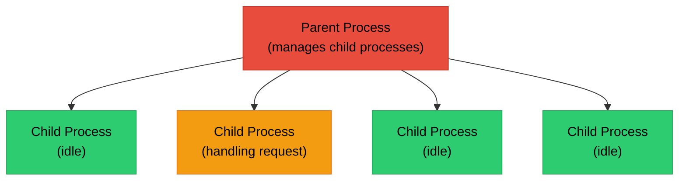
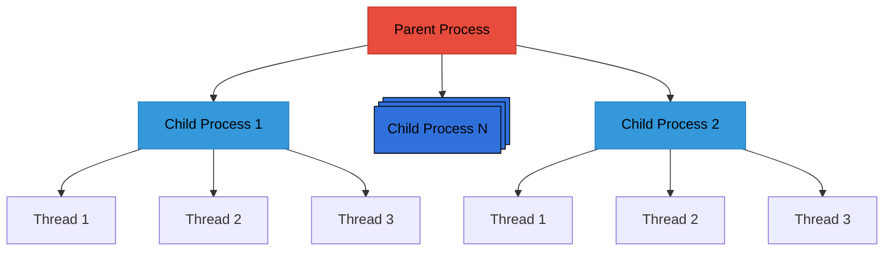
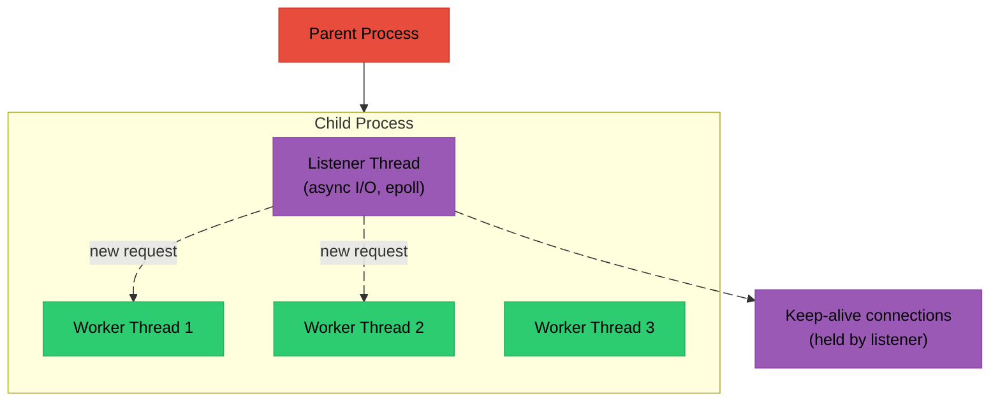
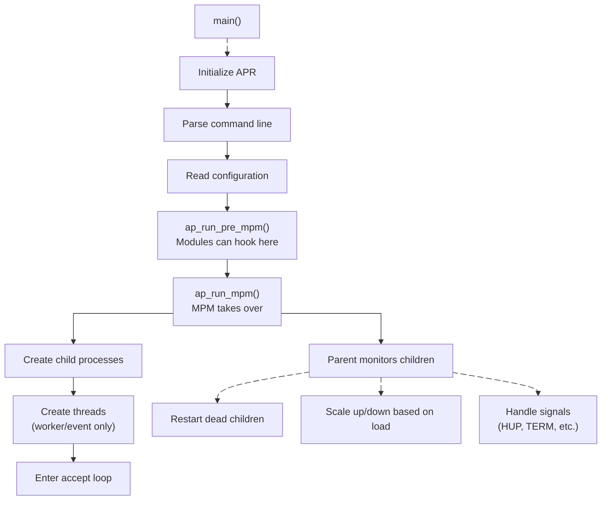

# Chapter 5: MPM - Multi-Processing Modules

## What is an MPM?

An MPM (Multi-Processing Module) controls how Apache handles concurrent connections. It determines:

- Process vs thread model
- How many workers are created
- How connections are distributed
- When new workers are spawned/killed

Unlike other modules, **only one MPM can be active at a time**. The MPM is Apache's "engine" that drives everything - it owns the main loop that accepts connections and dispatches them to the request processing pipeline.

## The Three Main MPMs

`````{tab-set}

````{tab-item} Prefork
The traditional Unix model: one process per connection.



**Characteristics:**
- Each child handles one connection at a time
- Process isolation (a crash in one child doesn't affect others)
- Safe for non-thread-safe modules (PHP with mod_php)
- Higher memory usage (each process has its own address space)
- Good for compatibility

**Configuration:**
```apache
<IfModule mpm_prefork_module>
    StartServers             5      # Initial child processes
    MinSpareServers          5      # Minimum idle processes
    MaxSpareServers         10      # Maximum idle processes
    MaxRequestWorkers      250      # Max concurrent connections
    MaxConnectionsPerChild   0      # Requests before child respawns (0=unlimited)
</IfModule>
```
````

````{tab-item} Worker
Hybrid model: multiple processes, each with multiple threads.



**Characteristics:**
- Each thread handles one connection
- Lower memory than prefork (threads share process memory)
- Requires thread-safe modules
- Better scalability

**Configuration:**
```apache
<IfModule mpm_worker_module>
    StartServers             3      # Initial child processes
    MinSpareThreads         75      # Minimum idle threads (total)
    MaxSpareThreads        250      # Maximum idle threads (total)
    ThreadsPerChild         25      # Threads per child process
    MaxRequestWorkers      400      # Max concurrent connections
    MaxConnectionsPerChild   0
</IfModule>
```
````

````{tab-item} Event
Async I/O model: a dedicated listener thread hands connections to worker threads, and idle keep-alive connections are handled asynchronously without tying up a worker.



**Characteristics:**
- Dedicated listener thread for async I/O
- Keep-alive connections don't tie up worker threads (this is the key innovation over Worker)
- Most efficient for high-traffic sites
- Requires thread-safe modules
- Default MPM on modern systems

**Configuration:**
```apache
<IfModule mpm_event_module>
    StartServers             3
    MinSpareThreads         75
    MaxSpareThreads        250
    ThreadsPerChild         25
    MaxRequestWorkers      400
    MaxConnectionsPerChild   0
    AsyncRequestWorkerFactor 2    # Async connections per worker
</IfModule>
```
````

`````

### Comparison

| Factor | Prefork | Worker | Event |
|--------|---------|--------|-------|
| Memory Usage | High | Medium | Medium |
| Thread Safety Required | No | Yes | Yes |
| Keep-alive Efficiency | Low | Medium | High |
| PHP mod_php | Yes | No | No |
| PHP-FPM | Yes | Yes | Yes |
| Max Connections | ~256 | ~10K | ~10K+ |
| Complexity | Simple | Medium | Complex |

**Recommendations:**
- **Prefork**: Legacy apps, mod_php, non-thread-safe modules
- **Worker**: Balanced performance, thread-safe modules
- **Event**: High-traffic sites, many keep-alive connections (default choice)

## How the MPM Interfaces with Apache

The MPM provides a hook that Apache's core calls to start handling connections:

```c
// The MPM registers this hook
ap_hook_mpm(event_run, NULL, NULL, APR_HOOK_MIDDLE);

// When called, the MPM:
// 1. Creates child processes
// 2. Creates threads (for worker/event)
// 3. Accepts connections
// 4. Calls ap_process_connection() for each connection
// 5. Manages worker lifecycle
```

## MPM Lifecycle

### Startup Sequence

When Apache starts, it initializes the runtime, parses configuration, and then hands control to the MPM. From that point on, the MPM owns the main loop - creating child processes, spawning threads, and managing their lifecycle:



### Connection Handling

When a connection arrives, the MPM creates a connection record and runs it through Apache's hook pipeline:

```c
// Inside the MPM accept loop:

// 1. Accept connection
apr_socket_accept(&client_sock, listen_sock, pool);

// 2. Create connection record
conn_rec *c = ap_run_create_connection(pool, server, client_sock,
                                       conn_id, sbh, bucket_alloc);

// 3. Run pre-connection hooks (e.g., mod_ssl sets up TLS here)
ap_run_pre_connection(c, client_sock);

// 4. Process the connection (reads requests, generates responses)
ap_process_connection(c, client_sock);

// 5. Cleanup
apr_pool_destroy(c->pool);
```

```{important}
**Fuzzing note**: The fuzzing harness bypasses this entire flow. Instead of the MPM accepting a socket connection, the harness creates a fake {httpd}`conn_rec` with a custom bucket allocator that reads from a memory buffer. The harness calls {httpd}`ap_process_connection` directly, which means everything from step 4 onward works normally - the request parsing, hook dispatch, and module handlers are all exercised. See the Harness Design guide for details.
```

## The {httpd}`ap_mpm_query` API

Modules can query MPM characteristics at runtime to adapt their behavior:

```c
int threaded, forked;

// Is this a threaded MPM?
ap_mpm_query(AP_MPMQ_IS_THREADED, &threaded);

// Is this a forked MPM?
ap_mpm_query(AP_MPMQ_IS_FORKED, &forked);

// Maximum threads per process?
int max_threads;
ap_mpm_query(AP_MPMQ_MAX_THREADS, &max_threads);

// Maximum child processes?
int max_daemons;
ap_mpm_query(AP_MPMQ_MAX_DAEMONS, &max_daemons);
```

Common query codes:
| Query Code | Description |
|------------|-------------|
| {httpd}`AP_MPMQ_MAX_DAEMON_USED` | Highest daemon index used |
| {httpd}`AP_MPMQ_IS_THREADED` | 0=no, 1=static, 2=dynamic |
| {httpd}`AP_MPMQ_IS_FORKED` | 0=no, 1=yes |
| {httpd}`AP_MPMQ_HARD_LIMIT_DAEMONS` | Compile-time max processes |
| {httpd}`AP_MPMQ_HARD_LIMIT_THREADS` | Compile-time max threads |
| {httpd}`AP_MPMQ_MAX_THREADS` | Current max threads per process |
| {httpd}`AP_MPMQ_MAX_DAEMONS` | Max child processes |
| {httpd}`AP_MPMQ_GENERATION` | Server generation number |

## Thread Safety Considerations

With threaded MPMs (Worker, Event), modules must be thread-safe. This means no unprotected global mutable state:

````{dropdown} DON'T: Global Mutable State
```c
// WRONG: Global variable shared across threads
static int request_count = 0;

static int my_handler(request_rec *r) {
    request_count++;  // Race condition!
    return OK;
}
```
````

````{dropdown} DO: Use Mutexes or Atomics
```c
// RIGHT: Protected global state
static apr_thread_mutex_t *count_mutex;
static int request_count = 0;

static int my_handler(request_rec *r) {
    apr_thread_mutex_lock(count_mutex);
    request_count++;
    apr_thread_mutex_unlock(count_mutex);
    return OK;
}

// Or use atomics for simple counters:
static apr_uint32_t request_count = 0;

static int my_handler(request_rec *r) {
    apr_atomic_inc32(&request_count);
    return OK;
}
```
````

````{dropdown} DO: Use Per-Request/Connection Data
```c
// RIGHT: Store state in request/connection (inherently thread-safe)
typedef struct {
    int my_data;
} my_request_state;

static int my_handler(request_rec *r) {
    my_request_state *state = apr_pcalloc(r->pool, sizeof(*state));
    state->my_data = 42;
    ap_set_module_config(r->request_config, &my_module, state);
    return OK;
}
```

Each request has its own pool and its own config vector, so per-request data is naturally thread-safe.
````

## Scoreboard

The scoreboard is shared memory used by MPMs to track worker status. The parent process uses it to monitor children, and tools like `mod_status` read it to display server metrics:

```c
#include "scoreboard.h"

// Parent can read all worker statuses
for (int i = 0; i < server_limit; i++) {
    for (int j = 0; j < thread_limit; j++) {
        worker_score *ws = ap_get_scoreboard_worker_from_indexes(i, j);
        if (ws->status == SERVER_BUSY_READ) {
            // Worker is reading request
        }
    }
}

// Workers update their own status
ap_update_child_status_from_indexes(child_num, thread_num,
                                    SERVER_BUSY_WRITE, r);
```

Worker status values:
| Status | Description |
|--------|-------------|
| {httpd}`SERVER_DEAD` | Not started or dead |
| {httpd}`SERVER_STARTING` | Starting up |
| {httpd}`SERVER_READY` | Waiting for connection |
| {httpd}`SERVER_BUSY_READ` | Reading request |
| {httpd}`SERVER_BUSY_WRITE` | Writing response |
| {httpd}`SERVER_BUSY_KEEPALIVE` | Keep-alive, waiting for request |
| {httpd}`SERVER_BUSY_LOG` | Logging |
| {httpd}`SERVER_BUSY_DNS` | DNS lookup |
| {httpd}`SERVER_CLOSING` | Closing connection |
| {httpd}`SERVER_GRACEFUL` | Gracefully finishing |
| {httpd}`SERVER_IDLE_KILL` | Marked for death |

```{note}
**Fun fact**: The scoreboard's shared memory region was at the heart of [CARPE (DIEM): CVE-2019-0211](https://cfreal.github.io/carpe-diem-cve-2019-0211-apache-local-root.html), a local root privilege escalation exploit. An attacker who could run code as an unprivileged Apache worker (e.g., via a mod_php bug) could corrupt the scoreboard's shared memory to hijack function pointers. When the privileged parent process read the scoreboard to manage its children, it followed the corrupted pointers and executed attacker-controlled code as root.
```

## MPM Module Structure

Here's a simplified view of what an MPM module looks like internally:

```c
// From server/mpm/event/event.c (simplified)

static int event_run(apr_pool_t *_pconf, apr_pool_t *plog, server_rec *s)
{
    // Set up shared memory (scoreboard)
    ap_scoreboard_image = ...;

    // Create child processes
    for (int i = 0; i < num_daemons; i++) {
        make_child(s, i);
    }

    // Parent loop: manage children
    while (!restart_pending && !shutdown_pending) {
        apr_proc_wait_all_procs(&proc, &exitcode, &why, APR_WAIT, pconf);

        if (child_died) {
            make_child(s, slot);  // Respawn
        }

        if (got_SIGHUP) {
            // Graceful restart
        }
    }

    return OK;
}

// Child process main function
static void child_main(int child_num)
{
    // Create threads
    for (int i = 0; i < threads_per_child; i++) {
        apr_thread_create(&threads[i], thread_attr,
                         worker_thread, (void*)i, pchild);
    }

    // Wait for threads
    apr_thread_join(&rv, threads[i]);
}

// Worker thread function
static void *worker_thread(apr_thread_t *thd, void *data)
{
    while (!dying) {
        // Get a connection from queue
        lr = listener_pop();

        // Accept connection
        apr_socket_accept(&sock, lr->sd, ptrans);

        // Create connection record
        conn_rec *c = ap_run_create_connection(ptrans, ...);

        // Process connection
        ap_run_pre_connection(c, sock);
        ap_process_connection(c, sock);

        // Cleanup
        apr_pool_clear(ptrans);
    }
    return NULL;
}

// Hook registration
static void event_hooks(apr_pool_t *p)
{
    ap_hook_mpm(event_run, NULL, NULL, APR_HOOK_MIDDLE);
}

AP_DECLARE_MODULE(mpm_event) = {
    STANDARD20_MODULE_STUFF,
    NULL, NULL, NULL, NULL,
    event_cmds,
    event_hooks
};
```

## Summary

MPMs are Apache's concurrency engine:

- **Prefork**: One process per connection, safe but heavy
- **Worker**: Threads in processes, balanced approach
- **Event**: Async I/O with listener thread, most efficient

Key points:
- Only one MPM active at a time
- MPM controls process/thread creation
- MPM calls {httpd}`ap_process_connection` for each connection
- Modules must be thread-safe for Worker/Event MPMs
- Use {httpd}`ap_mpm_query` to check MPM characteristics
- Scoreboard tracks worker status in shared memory

For fuzzing, the MPM is bypassed entirely - the harness creates a fake {httpd}`conn_rec` and calls {httpd}`ap_process_connection` directly, without any process/thread management overhead. This means the fuzzer exercises the full request processing pipeline but skips the network accept and process management layers.
