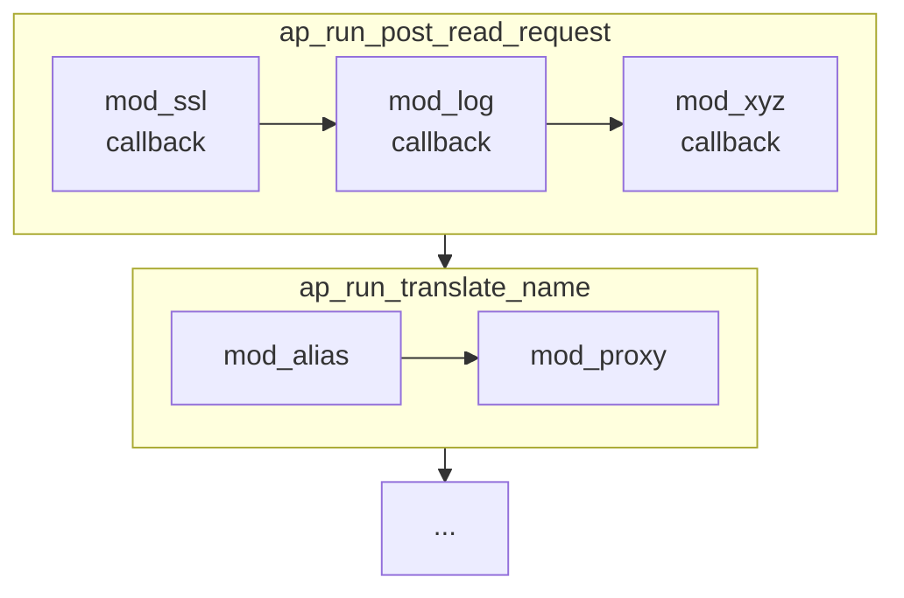
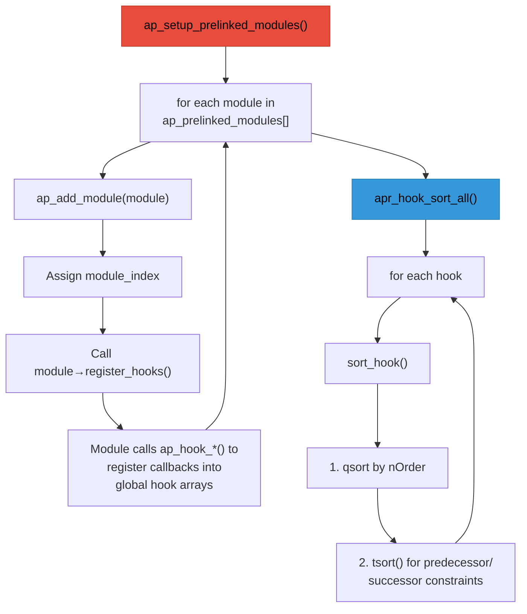
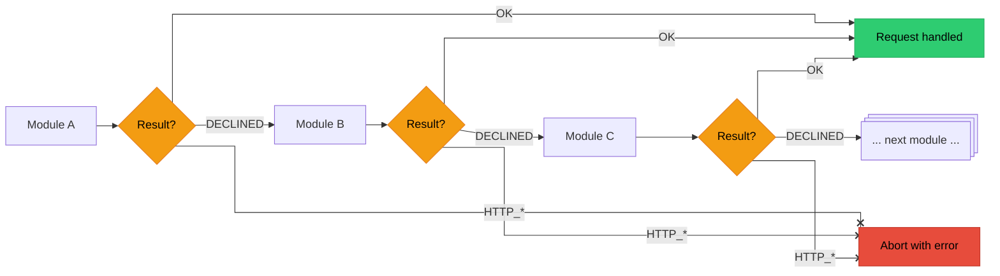

# Chapter 6: The Hook System

## What Are Hooks?

Hooks are Apache's primary extension mechanism. They allow modules to register callback functions that are called at specific points during request processing.

Think of hooks as **event listeners**. When Apache reaches a certain phase, it "runs" the hook - calling all registered callbacks in order.



## How Hooks Work

Every hook in Apache is generated by a pair of macros: one declares the hook's API, and the other implements the dispatch logic.

### The Hook Macros

{httpd}`AP_DECLARE_HOOK` (from `include/ap_hooks.h`) declares a hook's registration and run functions:

```c
// In a header file (e.g., http_request.h)
AP_DECLARE_HOOK(int, translate_name, (request_rec *r))
```

This expands (via {httpd}`APR_DECLARE_EXTERNAL_HOOK` in `srclib/apr-util/include/apr_hooks.h`) into three things:
1. **{httpd}`ap_hook_translate_name`** - the registration function modules call
2. **{httpd}`ap_run_translate_name`** - the dispatch function the core calls to invoke all registered callbacks
3. **A global {httpd}`apr_array_header_t`** that stores the list of registered callbacks for this hook

{httpd}`AP_IMPLEMENT_HOOK_RUN_FIRST` (from `include/ap_hooks.h`) provides the implementation. It wraps the APR-Util macro:

```c
// include/ap_hooks.h
#define AP_IMPLEMENT_HOOK_RUN_FIRST(ret, name, args_decl, args_use, decline) \
  APR_IMPLEMENT_EXTERNAL_HOOK_RUN_FIRST(ap, AP, ret, name, args_decl,        \
                                        args_use, decline)
```

````{dropdown} Full macro expansion for translate_name
For `translate_name`, this expands into three generated functions:

```c
// The registration function - called by modules in register_hooks()
void ap_hook_translate_name(ap_HOOK_translate_name_t *pf,
                            const char *const *aszPre,
                            const char *const *aszSucc, int nOrder) {
    ap_LINK_translate_name_t *pHook;
    if (!_hooks.link_translate_name) {
        _hooks.link_translate_name = apr_array_make(
            apr_hook_global_pool, 1, sizeof(ap_LINK_translate_name_t));
        apr_hook_sort_register("translate_name", &_hooks.link_translate_name);
    }
    pHook = apr_array_push(_hooks.link_translate_name);
    pHook->pFunc = pf;
    pHook->aszPredecessors = aszPre;
    pHook->aszSuccessors = aszSucc;
    pHook->nOrder = nOrder;
    pHook->szName = apr_hook_debug_current;
    if (apr_hook_debug_enabled)
        apr_hook_debug_show("translate_name", aszPre, aszSucc);
}

// Accessor for the hook's callback array
apr_array_header_t *ap_hook_get_translate_name(void) {
    return _hooks.link_translate_name;
}

// The dispatch function - called by the core to run all callbacks
int ap_run_translate_name(request_rec *r) {
    ap_LINK_translate_name_t *pHook;
    int n;
    int rv = -1;

    if (_hooks.link_translate_name) {
        pHook = (ap_LINK_translate_name_t *)_hooks.link_translate_name->elts;
        for (n = 0; n < _hooks.link_translate_name->nelts; ++n) {
            rv = pHook[n].pFunc(r);
            if (rv != -1)   // -1 is DECLINED - keep going
                break;       // Any other value stops the chain
        }
    }
    return rv;
}
```

A few things to note:
- **Lazy initialization**: The hook's callback array is only created when the first module registers for it ({httpd}`apr_array_make` inside {httpd}`ap_hook_translate_name`).
- **{httpd}`apr_hook_sort_register`**: Each hook registers itself with the global sort system so {httpd}`apr_hook_sort_all` can find it later.
- **The `_hooks` struct**: All hooks for a module share a static struct (`_hooks`) that holds their callback arrays. This is generated by the macro.
- **`DECLINED` is -1**: The `RUN_FIRST` dispatch loop checks `rv != -1` (which is `DECLINED`) to decide whether to continue. Any other return value - `OK (0)`, `DONE`, or an `HTTP_*` error code - stops iteration.
````

There are two dispatch variants:

- **`RUN_FIRST`**: Calls callbacks until one returns something other than `DECLINED`. Used by most hooks (translate_name, handler, etc.)
- **`RUN_ALL`**: Calls every callback and only stops on error. Used by hooks where all modules should participate (log_transaction, etc.)

### Module Loading and Hook Registration

When Apache starts, it discovers all compiled-in modules, calls their `register_hooks` functions, and sorts the resulting callbacks. This is driven by {httpd}`ap_setup_prelinked_modules` in `server/config.c`.

When you build Apache with `--enable-mods-static=all` (as the fuzzer does), the build system generates a file called `modules.c` that lists every statically linked module in the {httpd}`ap_prelinked_modules` array:

```c
// Generated modules.c
module *ap_prelinked_modules[] = {
    &core_module,
    &so_module,
    &http_module,
    &mod_session,
    &mod_session_cookie,
    &mod_session_crypto,
    // ... every statically compiled module
    NULL  // sentinel
};
```

{httpd}`ap_setup_prelinked_modules` walks this array and initializes each module:

```c
// server/config.c (simplified)
void ap_setup_prelinked_modules(process_rec *process)
{
    // 1. Walk the prelinked module array
    for (module **m = ap_prelinked_modules; *m != NULL; m++) {
        // Assign each module a unique index (module_index)
        // and call its register_hooks function
        ap_add_module(*m, process->pconf, NULL);
    }

    // 2. After ALL modules have registered their hooks,
    //    sort every hook's callback list
    apr_hook_sort_all();
}
```

{httpd}`ap_add_module` does the critical work for each module:
- Assigns a unique `module_index` (used for per-module config vectors)
- Calls the module's `register_hooks()` function, which populates the global hook arrays

### Hook Sorting

After every module has registered, {httpd}`apr_hook_sort_all` resolves the final ordering. It iterates over every registered hook and performs a two-phase sort:

1. **Numeric sort** (`qsort` by `nOrder`) - groups callbacks by their priority constant
2. **Topological sort** (`tsort()`) - within the same priority level, resolves predecessor/successor constraints into a valid ordering



The final callback order for any hook is determined by:
1. The `APR_HOOK_*` constant (coarse ordering)
2. The predecessor/successor lists (fine-grained ordering within the same level)
3. Registration order (as a tiebreaker when everything else is equal)

```{note}
**Security note**: Hook phase and ordering bugs are a real attack surface. The order of `LoadModule` directives in the config affects hook execution order - changing it can introduce silent inconsistencies that yield useful exploit primitives like header manipulation, auth bypass, or unexpected state reaching downstream handlers.
```

## Using Hooks

### Registering for a Hook

Modules register callbacks in their `register_hooks` function:

```c
static int my_translate_name(request_rec *r)
{
    if (should_handle(r)) {
        r->filename = apr_pstrdup(r->pool, "/my/path");
        return OK;
    }
    return DECLINED;
}

static void register_hooks(apr_pool_t *p)
{
    ap_hook_translate_name(my_translate_name, NULL, NULL, APR_HOOK_MIDDLE);
}
```

The fourth parameter controls callback ordering:

```
APR_HOOK_REALLY_FIRST (-10)
        │  mod_ssl pre_connection (needs to wrap socket early)
        ▼
APR_HOOK_FIRST (0)
        │  Core handlers, security modules
        ▼
APR_HOOK_MIDDLE (10)
        │  Most modules register here
        │  mod_rewrite, mod_alias, etc.
        ▼
APR_HOOK_LAST (20)
        │  Fallback handlers
        │  mod_autoindex, mod_dir
        ▼
APR_HOOK_REALLY_LAST (30)
        │  Final cleanup, logging
        │  mod_log_config
```

For fine-grained control, specify modules that must run before/after:

```c
static const char *predecessors[] = { "mod_alias.c", NULL };
static const char *successors[] = { "mod_proxy.c", NULL };

static void register_hooks(apr_pool_t *p)
{
    // Run after mod_alias, before mod_proxy
    ap_hook_translate_name(my_translate_name,
                          predecessors,  // Must run after these
                          successors,    // Must run before these
                          APR_HOOK_MIDDLE);
}
```

### Return Values

Return values control how hook execution proceeds:

```c
OK                  // Success - continue processing
DECLINED            // Not handled - let others try
DONE                // Request complete - skip remaining phases
HTTP_*              // HTTP error code - abort with error
```

For `RUN_FIRST` hooks (most hooks), the chain works like this:



### Creating Custom Hooks

Modules can define their own hooks for other modules to use:

```c
// In my_module.h - declare the hook
AP_DECLARE_HOOK(int, my_custom_hook, (request_rec *r, const char *data))

// In my_module.c - implement hook infrastructure
APR_IMPLEMENT_EXTERNAL_HOOK_RUN_ALL(ap, MY_MODULE, int, my_custom_hook,
                                    (request_rec *r, const char *data),
                                    (r, data), OK, DECLINED)

// Call the hook somewhere in your module
int rv = ap_run_my_custom_hook(r, "some data");

// Other modules can now hook:
ap_hook_my_custom_hook(their_callback, NULL, NULL, APR_HOOK_MIDDLE);
```

## Hook Reference

### Request Processing Hooks

These hooks run in order for each HTTP request. All have the signature `int (*)(request_rec *r)`:

````{dropdown} 1. Post-Read-Request
First chance to examine a request after headers are read.

```c
ap_hook_post_read_request(my_post_read, NULL, NULL, APR_HOOK_MIDDLE);

static int my_post_read(request_rec *r)
{
    // Log initial request info
    // Set up per-request state
    return DECLINED;  // Let others run too
}
```
````

````{dropdown} 2. Translate Name
Map URI to filename or handler.

```c
ap_hook_translate_name(my_translate, NULL, NULL, APR_HOOK_MIDDLE);

static int my_translate(request_rec *r)
{
    if (strncmp(r->uri, "/special/", 9) == 0) {
        r->filename = apr_pstrcat(r->pool, "/var/special",
                                  r->uri + 8, NULL);
        return OK;  // We handled it
    }
    return DECLINED;
}
```
````

````{dropdown} 3. Map to Storage
Called after translate_name, before access checking.

```c
ap_hook_map_to_storage(my_map, NULL, NULL, APR_HOOK_MIDDLE);
```
````

````{dropdown} 4. Header Parser
Parse request headers.

```c
ap_hook_header_parser(my_header_parser, NULL, NULL, APR_HOOK_MIDDLE);
```
````

````{dropdown} 5. Access Checker
IP/host-based access control (before authentication).

```c
ap_hook_access_checker(my_access_checker, NULL, NULL, APR_HOOK_MIDDLE);

static int my_access_checker(request_rec *r)
{
    if (is_banned_ip(r->useragent_ip)) {
        return HTTP_FORBIDDEN;
    }
    return DECLINED;
}
```
````

````{dropdown} 6. Check User ID (Authentication)
Authenticate the user.

```c
ap_hook_check_user_id(my_authn, NULL, NULL, APR_HOOK_MIDDLE);

static int my_authn(request_rec *r)
{
    const char *auth_header = apr_table_get(r->headers_in, "Authorization");
    if (!auth_header) {
        return DECLINED;
    }

    if (validate_auth(auth_header)) {
        r->user = apr_pstrdup(r->pool, username);
        return OK;
    }
    return HTTP_UNAUTHORIZED;
}
```
````

````{dropdown} 7. Auth Checker (Authorization)
Check if authenticated user is authorized.

```c
ap_hook_auth_checker(my_authz, NULL, NULL, APR_HOOK_MIDDLE);

static int my_authz(request_rec *r)
{
    if (!r->user) {
        return DECLINED;
    }

    if (user_has_access(r->user, r->uri)) {
        return OK;
    }
    return HTTP_FORBIDDEN;
}
```
````

````{dropdown} 8. Type Checker
Determine content type and handler.

```c
ap_hook_type_checker(my_type_checker, NULL, NULL, APR_HOOK_MIDDLE);

static int my_type_checker(request_rec *r)
{
    if (r->filename && ends_with(r->filename, ".xyz")) {
        ap_set_content_type(r, "application/x-xyz");
        r->handler = "xyz-handler";
        return OK;
    }
    return DECLINED;
}
```
````

````{dropdown} 9. Fixups
Last chance to modify request before handler.

```c
ap_hook_fixups(my_fixup, NULL, NULL, APR_HOOK_MIDDLE);

static int my_fixup(request_rec *r)
{
    apr_table_set(r->headers_out, "X-Processed-By", "MyModule");
    return DECLINED;
}
```
````

````{dropdown} 10. Handler
Generate the response content.

```c
ap_hook_handler(my_handler, NULL, NULL, APR_HOOK_MIDDLE);

static int my_handler(request_rec *r)
{
    if (!r->handler || strcmp(r->handler, "my-handler") != 0) {
        return DECLINED;
    }

    ap_set_content_type(r, "text/plain");
    ap_rputs("Hello from my handler!\n", r);
    return OK;
}
```
````

````{dropdown} 11. Log Transaction
Log the completed request.

```c
ap_hook_log_transaction(my_logger, NULL, NULL, APR_HOOK_MIDDLE);

static int my_logger(request_rec *r)
{
    log_request(r->uri, r->status, r->bytes_sent);
    return OK;
}
```
````

### Connection Hooks

These hooks operate at the connection level, before HTTP parsing:

````{dropdown} Pre-Connection
Set up connection state, filters, etc.

```c
// Signature: int (*)(conn_rec *c, void *csd)
ap_hook_pre_connection(my_pre_conn, NULL, NULL, APR_HOOK_MIDDLE);

static int my_pre_conn(conn_rec *c, void *csd)
{
    // csd is the socket descriptor
    ap_add_input_filter("MY_INPUT", NULL, NULL, c);
    return OK;
}
```
````

````{dropdown} Process Connection
Handle the entire connection (used by protocol modules).

```c
// Signature: int (*)(conn_rec *c)
ap_hook_process_connection(my_process_conn, NULL, NULL, APR_HOOK_MIDDLE);

static int my_process_conn(conn_rec *c)
{
    // Custom protocol handler
    // Return OK to claim the connection
    return DECLINED;  // Let HTTP handle it
}
```
````

````{dropdown} Create Connection
Create the {httpd}`conn_rec` structure.

```c
// Signature: conn_rec* (*)(apr_pool_t *p, server_rec *s, ...)
ap_hook_create_connection(my_create_conn, NULL, NULL, APR_HOOK_MIDDLE);
```
````

### Server Lifecycle Hooks

These hooks run during server startup and shutdown:

````{dropdown} Pre Config
Called before configuration is loaded.

```c
// Signature: int (*)(apr_pool_t *pconf, apr_pool_t *plog, apr_pool_t *ptemp)
ap_hook_pre_config(my_pre_config, NULL, NULL, APR_HOOK_MIDDLE);
```
````

````{dropdown} Post Config
Called after configuration is loaded.

```c
// Signature: int (*)(apr_pool_t *pconf, apr_pool_t *plog,
//                    apr_pool_t *ptemp, server_rec *s)
ap_hook_post_config(my_post_config, NULL, NULL, APR_HOOK_MIDDLE);

static int my_post_config(apr_pool_t *pconf, apr_pool_t *plog,
                          apr_pool_t *ptemp, server_rec *s)
{
    // Validate configuration
    // Allocate shared resources
    return OK;
}
```
````

````{dropdown} Open Logs
Called when log files should be opened.

```c
// Signature: int (*)(apr_pool_t *pconf, apr_pool_t *plog,
//                    apr_pool_t *ptemp, server_rec *s)
ap_hook_open_logs(my_open_logs, NULL, NULL, APR_HOOK_MIDDLE);
```
````

````{dropdown} Child Init
Called when a child process starts.

```c
// Signature: void (*)(apr_pool_t *p, server_rec *s)
ap_hook_child_init(my_child_init, NULL, NULL, APR_HOOK_MIDDLE);

static void my_child_init(apr_pool_t *p, server_rec *s)
{
    // Initialize per-child resources
    // Open database connections, etc.
}
```
````

## Complete Example

Here's a module using multiple hooks to track request timing:

```c
#include "httpd.h"
#include "http_config.h"
#include "http_protocol.h"
#include "http_request.h"
#include "ap_config.h"

module AP_MODULE_DECLARE_DATA example_module;

typedef struct {
    apr_time_t start_time;
} example_request_state;

// Post-read: record start time
static int example_post_read(request_rec *r)
{
    example_request_state *state = apr_pcalloc(r->pool, sizeof(*state));
    state->start_time = apr_time_now();
    ap_set_module_config(r->request_config, &example_module, state);
    return DECLINED;
}

// Fixup: add custom header
static int example_fixup(request_rec *r)
{
    apr_table_set(r->headers_out, "X-Example-Module", "active");
    return DECLINED;
}

// Handler: respond to /example
static int example_handler(request_rec *r)
{
    if (!r->handler || strcmp(r->handler, "example-handler") != 0) {
        return DECLINED;
    }

    example_request_state *state = ap_get_module_config(
        r->request_config, &example_module);

    ap_set_content_type(r, "text/plain");
    ap_rputs("Hello from Example Module!\n", r);

    if (state) {
        apr_time_t elapsed = apr_time_now() - state->start_time;
        ap_rprintf(r, "Processing time: %" APR_TIME_T_FMT " microseconds\n",
                   elapsed);
    }

    return OK;
}

// Log: record timing
static int example_log(request_rec *r)
{
    example_request_state *state = ap_get_module_config(
        r->request_config, &example_module);

    if (state) {
        apr_time_t elapsed = apr_time_now() - state->start_time;
        ap_log_rerror(APLOG_MARK, APLOG_DEBUG, 0, r,
                      "Request to %s took %" APR_TIME_T_FMT " us",
                      r->uri, elapsed);
    }

    return OK;
}

// Register hooks
static void register_hooks(apr_pool_t *p)
{
    ap_hook_post_read_request(example_post_read, NULL, NULL,
                              APR_HOOK_FIRST);
    ap_hook_fixups(example_fixup, NULL, NULL,
                   APR_HOOK_MIDDLE);
    ap_hook_handler(example_handler, NULL, NULL,
                    APR_HOOK_MIDDLE);
    ap_hook_log_transaction(example_log, NULL, NULL,
                            APR_HOOK_LAST);
}

AP_DECLARE_MODULE(example) = {
    STANDARD20_MODULE_STUFF,
    NULL, NULL, NULL, NULL,
    NULL,  // No directives
    register_hooks
};
```

**See also:** [mod_example_hooks.c](https://github.com/omnigroup/Apache/blob/master/httpd/modules/examples/mod_example_hooks.c) (Apache's own hook tracing module) and the official [module development guide](https://httpd.apache.org/docs/2.4/developer/modguide.html).

## Fuzzing Implications

```{important}
Understanding hook infrastructure matters for the fuzzing harness:

- **Static linking** means {httpd}`ap_prelinked_modules` contains every module we want to fuzz. The harness calls {httpd}`ap_setup_prelinked_modules` during initialization, which registers all hooks exactly as a real Apache would.
- **Hook ordering is deterministic** for a given set of compiled modules. This means fuzzing results are reproducible - the same input always hits the same callback chain in the same order.
- **The harness can selectively disable modules** by manipulating the module list before {httpd}`ap_setup_prelinked_modules` runs, which is useful for isolating specific code paths during targeted fuzzing.
```

## Summary

Hooks are Apache's plugin system:

- {httpd}`AP_DECLARE_HOOK` generates `ap_hook_*` (register) and `ap_run_*` (dispatch) functions from macros
- Modules register callbacks in `register_hooks()` with an ordering constant ({httpd}`APR_HOOK_FIRST` / `MIDDLE` / `LAST`) or predecessor/successor lists
- `RUN_FIRST` hooks stop on the first non-`DECLINED` return; `RUN_ALL` hooks call every callback
- {httpd}`ap_setup_prelinked_modules` loads all modules, calls their `register_hooks`, and {httpd}`apr_hook_sort_all` resolves the final ordering
- Return `DECLINED` to pass, `OK` when handled, `HTTP_*` to abort
