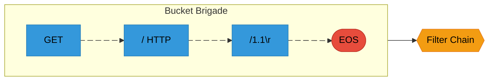
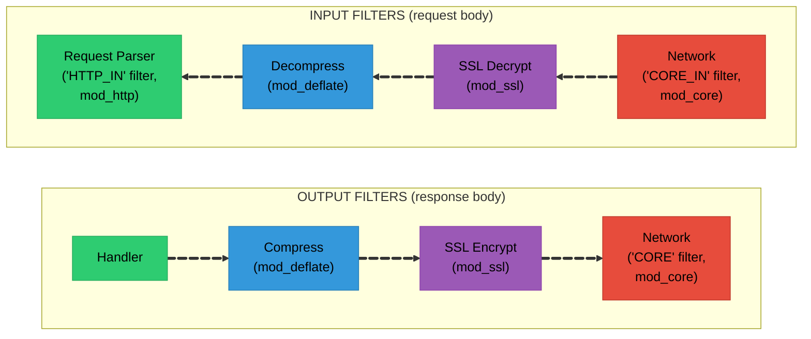

# Chapter 7: Filters and Bucket Brigades

## The Problem: Streaming Data

A web server needs to handle data that:
- May be too large to fit in memory
- Arrives in chunks (network packets)
- Needs transformation (compression, encryption)
- Must be sent before it's fully received (streaming)

Traditional approaches like "read everything into a buffer" don't scale.

## Apache's Solution: Bucket Brigades

Apache uses a **bucket brigade** system - a linked list of data chunks that flows through a chain of filters.



The key design principle is **zero-copy where possible**. A file bucket doesn't read file data into memory - it holds a file descriptor and reads on demand. A transient bucket points to existing memory without copying it. Only when data needs to outlive its original context does Apache copy it into a heap or pool bucket. This makes serving large files or proxying responses efficient: data flows through the filter chain without being fully materialized in memory.

## Buckets

A bucket is a single chunk of data with a **type** that determines how its data is stored and accessed. Every bucket type implements the same vtable interface, defined in `srclib/apr-util/include/apr_buckets.h`:

```c
// srclib/apr-util/include/apr_buckets.h
struct apr_bucket_type_t {
    const char *name;
    int num_func;
    enum {
        APR_BUCKET_DATA = 0,       // Actual content data
        APR_BUCKET_METADATA = 1    // Metadata (EOS, FLUSH, etc.)
    } is_metadata;
    void (*destroy)(void *data);
    apr_status_t (*read)(apr_bucket *b, const char **str,
                         apr_size_t *len, apr_read_type_e block);
    apr_status_t (*setaside)(apr_bucket *e, apr_pool_t *pool);
    apr_status_t (*split)(apr_bucket *e, apr_size_t point);
    apr_status_t (*copy)(apr_bucket *e, apr_bucket **c);
};

struct apr_bucket {
    APR_RING_ENTRY(apr_bucket) link;     // Links to brigade ring
    const apr_bucket_type_t *type;       // Vtable for this bucket
    apr_size_t length;                   // Data length (-1 if unknown)
    apr_off_t start;                     // Offset into backing data
    void *data;                          // Type-dependent private data
    void (*free)(void *e);               // Deallocator for this bucket
    apr_bucket_alloc_t *list;            // Freelist this came from
};
```

The {httpd}`apr_bucket_type_t::setaside` function is particularly important: it "morphs" a bucket from a short-lived type to a long-lived one. For example, when a transient bucket (pointing to stack data) needs to survive beyond the current function call, `setaside` copies the data to the heap and converts it to a heap bucket. This is how Apache achieves zero-copy in the common case while still handling lifetime mismatches safely.

### Data Buckets

Data buckets carry actual content bytes. They differ in how the data is stored and who owns it:

`````{tab-set}

````{tab-item} Heap Bucket
**Heap Bucket:** Data is `malloc`'d on the heap. Use this when you've generated data that needs to outlive the current scope. The `free_func` is called when the last reference to this data is destroyed (multiple buckets can share the same backing data after a split).

```c
apr_bucket *b = apr_bucket_heap_create(data, len, free_func, alloc);
```
````

````{tab-item} Pool Bucket
**Pool Bucket:** Data lives in an APR pool. Use this when the data was allocated from a pool and you want the bucket's lifetime tied to that pool. If the pool is destroyed before the bucket, `setaside` automatically morphs it to a heap bucket.

```c
apr_bucket *b = apr_bucket_pool_create(data, len, pool, alloc);
```
````

````{tab-item} Transient Bucket
**Transient Bucket:** A zero-copy reference to temporary data (e.g., a stack buffer or a buffer that will be reused). The data must be consumed or set aside before the next filter call, because the backing memory may disappear. This is the cheapest bucket to create - no copies, no allocations beyond the bucket struct itself.

```c
apr_bucket *b = apr_bucket_transient_create(data, len, alloc);
```
````

````{tab-item} Immortal Bucket
**Immortal Bucket:** 
A reference to permanent, read-only data like string constants or global buffers. Since the data will never be freed, `setaside` is a no-op. Use this for static content.

```c
apr_bucket *b = apr_bucket_immortal_create("Hello", 5, alloc);
```
````

`````

### I/O Buckets

These buckets represent data that comes from an external source. They have **unknown length** (`(apr_size_t)(-1)`) until read, and reading them may block:

`````{tab-set}

````{tab-item} File Bucket
**File Bucket:** Represents a range of bytes from a file on disk. The data is read into memory lazily, only when a downstream filter calls `apr_bucket_read()`. This is how Apache serves static files efficiently - `sendfile()` can even bypass userspace entirely.

```c
apr_bucket *b = apr_bucket_file_create(file, offset, len, pool, alloc);
```
````

````{tab-item} Pipe Bucket
**Pipe Bucket:** Data from a pipe (e.g., CGI script output). Can only be read once and in order. Cannot be split or copied.

```c
apr_bucket *b = apr_bucket_pipe_create(pipe, alloc);
```
````

````{tab-item} Socket
**Socket Bucket:** Data from a network socket. This is what the core input filter creates to represent incoming request data. Like pipe buckets, socket reads are sequential and may block.

```c
apr_bucket *b = apr_bucket_socket_create(sock, alloc);
```
````

`````

### Metadata Buckets

Metadata buckets carry no data content ({httpd}`apr_bucket_type_t::is_metadata`= 1) - they are signals that control how the filter chain behaves:

**EOS (End-Of-Stream)** - marks the end of a response or request body. Every response must end with an EOS bucket. Filters use it to know when to finalize their processing (e.g., write a compression trailer, flush buffered content).

```c
apr_bucket *b = apr_bucket_eos_create(alloc);
```

**FLUSH** - tells downstream filters to flush any buffered data immediately. Used when partial data needs to reach the client before the response is complete (e.g., server-sent events, chunked streaming).

```c
apr_bucket *b = apr_bucket_flush_create(alloc);
```

### The EOS Bucket

The EOS (End-Of-Stream) bucket is critical:
- It marks the logical end of a response/request body
- Filters should pass it through (never consume or drop it)
- Handlers must send it to complete the response
- Without an EOS, the client will hang waiting for more data

## Bucket Brigades

A bucket brigade is a doubly-linked ring of buckets, implemented with APR's ring macros. The brigade itself is just a sentinel node - buckets are inserted, removed, and iterated using ring operations:

```c
// Create a brigade
apr_bucket_brigade *bb = apr_brigade_create(pool, bucket_alloc);
//...
// Insert bucket at end/front
//...

// Get first/last bucket
apr_bucket *first = APR_BRIGADE_FIRST(bb);
apr_bucket *last = APR_BRIGADE_LAST(bb);

// Iterate over buckets
for (apr_bucket *b = APR_BRIGADE_FIRST(bb);
     b != APR_BRIGADE_SENTINEL(bb);
     b = APR_BUCKET_NEXT(b)) {
    // Process bucket
}
```

### Reading Bucket Data

All bucket types expose their contents through a single `apr_bucket_read` call that supports both blocking and non-blocking modes:

```c
const char *data;
apr_size_t len;

// Read bucket contents
apr_status_t rv = apr_bucket_read(bucket, &data, &len, APR_BLOCK_READ);

if (rv == APR_SUCCESS) {
    // data points to len bytes
    // WARNING: data may be invalidated after bucket operations!
}

// Non-blocking read
rv = apr_bucket_read(bucket, &data, &len, APR_NONBLOCK_READ);
if (rv == APR_EAGAIN) {
    // Data not ready yet
}
```

### Brigade Operations

Brigades can be concatenated, split, flattened into a contiguous buffer, or cleaned up:

```c
// Concatenate: append bb2 to bb1
APR_BRIGADE_CONCAT(bb1, bb2);

// Prepend: insert bb2 at start of bb1
APR_BRIGADE_PREPEND(bb1, bb2);

// Split: move buckets after 'e' to new brigade
apr_brigade_split(bb, e);

// Flatten: copy all data to a buffer
apr_size_t len;
apr_brigade_flatten(bb, buffer, &len);

// Destroy: cleanup brigade and all buckets
apr_brigade_destroy(bb);

// Cleanup: remove all buckets but keep brigade
apr_brigade_cleanup(bb);
```

## Filters

Filters transform data as it flows through Apache. There are two directions:



```{note}
A **handler** is the module function that generates the actual response content. 

It's triggered when a request matches a `SetHandler` or `AddHandler` directive in the Apache config (e.g., `SetHandler cgi-script` routes to mod_cgi). 
The handler hook was covered in [Chapter 6](06-hooks.md) - see also the official [handler documentation](https://httpd.apache.org/docs/current/handler.html) and [module development guide](https://httpd.apache.org/docs/2.4/developer/modguide.html).
```

### Filter Types

Filters are categorized into levels that determine their position in the chain. The type constants are defined in `include/util_filter.h` and represent a numeric ordering - lower numbers run closer to the handler, higher numbers run closer to the network:

| Constant | Value | Description |
|----------|-------|-------------|
| {httpd}`AP_FTYPE_RESOURCE` | 10 | Content generators (`mod_include` SSI) |
| {httpd}`AP_FTYPE_CONTENT_SET` | 20 | Content transformers (`mod_deflate`) |
| {httpd}`AP_FTYPE_PROTOCOL` | 30 | Protocol framing (HTTP chunking) |
| {httpd}`AP_FTYPE_TRANSCODE` | 40 | Charset/encoding conversion |
| {httpd}`AP_FTYPE_CONNECTION` | 50 | Connection-level (`mod_ssl`) |
| {httpd}`AP_FTYPE_NETWORK` | 60 | Actual I/O (core socket read/write) |

For **output filters**, data flows from low to high - the handler's output passes through `RESOURCE` filters first, then `CONTENT_SET`, and so on until `NETWORK` actually writes to the socket. For **input filters**, the direction is reversed - the `NETWORK` filter reads raw bytes from the socket, and higher-level filters progressively decode and transform them before the handler sees the data.

This layering ensures that content transformation (like gzip compression) always happens before protocol framing (like HTTP chunking), which always happens before encryption (SSL), which always happens before network I/O. The numeric values also allow fine-grained positioning: a filter can register at `AP_FTYPE_CONTENT_SET + 5` to run after other content-set filters.

### Registering a Filter

Filters are registered globally during module initialization, specifying a name, callback function, and filter type level:

```c
// Output filter registration
ap_register_output_filter("MY_OUTPUT",     // Filter name
                         my_output_filter, // Function
                         NULL,             // Init function (optional)
                         AP_FTYPE_CONTENT_SET);

// Input filter registration
ap_register_input_filter("MY_INPUT",
                        my_input_filter,
                        NULL,
                        AP_FTYPE_CONTENT_SET);
```

### Adding Filters to Request/Connection

Once registered, filters are attached to individual requests or connections - request-scoped filters are removed after the response, while connection-scoped filters persist for the entire connection:

```c
// Add output filter to request
ap_add_output_filter("MY_OUTPUT", ctx, r, r->connection);

// Add input filter to request
ap_add_input_filter("MY_INPUT", ctx, r, r->connection);

// Add to connection (lives for entire connection)
ap_add_input_filter("SSL_IN", ctx, NULL, c);
ap_add_output_filter("SSL_OUT", ctx, NULL, c);
```

### Output Filter Implementation

An output filter receives a bucket brigade, iterates through it, transforms data buckets while passing metadata through, then forwards the brigade to the next filter:

```c
static apr_status_t my_output_filter(ap_filter_t *f,
                                     apr_bucket_brigade *bb)
{
    request_rec *r = f->r;
    apr_bucket *b;

    // Iterate through buckets
    for (b = APR_BRIGADE_FIRST(bb);
         b != APR_BRIGADE_SENTINEL(bb);
         b = APR_BUCKET_NEXT(b)) {

        // Handle metadata buckets
        if (APR_BUCKET_IS_EOS(b)) {
            // End of stream - pass through
            break;
        }
        if (APR_BUCKET_IS_FLUSH(b)) {
            // Flush request - pass through
            continue;
        }
        if (APR_BUCKET_IS_METADATA(b)) {
            // Other metadata - pass through
            continue;
        }

        // Read data bucket
        const char *data;
        apr_size_t len;
        apr_status_t rv = apr_bucket_read(b, &data, &len, APR_BLOCK_READ);
        if (rv != APR_SUCCESS) {
            return rv;
        }

        // Transform data (example: uppercase)
        char *transformed = apr_palloc(r->pool, len);
        for (apr_size_t i = 0; i < len; i++) {
            transformed[i] = toupper(data[i]);
        }

        // Replace bucket with transformed data
        apr_bucket *new_b = apr_bucket_heap_create(
            transformed, len, NULL, f->c->bucket_alloc);
        APR_BUCKET_INSERT_BEFORE(b, new_b);
        apr_bucket_delete(b);
        b = new_b;
    }

    // Pass to next filter
    return ap_pass_brigade(f->next, bb);
}
```

### Input Filter Implementation

Input filters are more complex because they handle read modes:

```c
static apr_status_t my_input_filter(ap_filter_t *f,
                                    apr_bucket_brigade *bb,
                                    ap_input_mode_t mode,
                                    apr_read_type_e block,
                                    apr_off_t readbytes)
{
    my_filter_ctx *ctx = f->ctx;

    // Initialize context on first call
    if (!ctx) {
        ctx = f->ctx = apr_pcalloc(f->r->pool, sizeof(*ctx));
        ctx->bb = apr_brigade_create(f->r->pool, f->c->bucket_alloc);
    }

    // Handle different read modes
    switch (mode) {
    case AP_MODE_GETLINE:
        // Read until newline
        return get_line_from_filters(f, bb, ctx);

    case AP_MODE_READBYTES:
        // Read up to readbytes
        return read_bytes_from_filters(f, bb, readbytes, ctx);

    case AP_MODE_SPECULATIVE:
        // Peek at data without consuming
        return speculative_read(f, bb, readbytes, ctx);

    case AP_MODE_EXHAUSTIVE:
        // Read all remaining data
        return exhaustive_read(f, bb, ctx);

    case AP_MODE_INIT:
        // Initialize
        return APR_SUCCESS;
    }

    return APR_ENOTIMPL;
}

// Helper: read from upstream filter
static apr_status_t get_upstream_data(ap_filter_t *f,
                                      apr_bucket_brigade *bb,
                                      apr_read_type_e block,
                                      apr_off_t readbytes)
{
    return ap_get_brigade(f->next, bb, AP_MODE_READBYTES, block, readbytes);
}
```

### Input Mode Constants

Input filters must handle multiple read modes because different parts of HTTP processing need to read data differently. The HTTP request parser reads headers line-by-line (`GETLINE`), then reads the body in sized chunks (`READBYTES`). These modes are defined in `include/util_filter.h`:

| Mode | Description |
|------|-------------|
| {httpd}`AP_MODE_READBYTES` | Read up to N bytes (body data) |
| {httpd}`AP_MODE_GETLINE` | Read a line terminated by `\n` (header parsing) |
| {httpd}`AP_MODE_EATCRLF` | Consume leading CRLF without returning data |
| {httpd}`AP_MODE_SPECULATIVE` | Peek at data without consuming (lookahead) |
| {httpd}`AP_MODE_EXHAUSTIVE` | Read all remaining data |
| {httpd}`AP_MODE_INIT` | Initialize filter (one-time setup) |

The `SPECULATIVE` mode is particularly interesting - it lets a filter peek ahead without consuming the data. The HTTP/1.1 parser uses this to detect whether a pipelined request is waiting after the current one finishes.

## Filter Context

Filters are called repeatedly - once per brigade chunk - so they need persistent state across invocations. The `f->ctx` pointer stores a filter-allocated context struct, typically initialized on the first call:

```c
typedef struct {
    apr_bucket_brigade *bb;    // Buffered data
    int state;                 // Current state
    apr_size_t bytes_read;     // Running total
    char *buffer;              // Work buffer
} my_filter_ctx;

static apr_status_t my_filter(ap_filter_t *f, apr_bucket_brigade *bb)
{
    my_filter_ctx *ctx = f->ctx;

    if (!ctx) {
        // First call - initialize
        ctx = f->ctx = apr_pcalloc(f->r->pool, sizeof(*ctx));
        ctx->bb = apr_brigade_create(f->r->pool, f->c->bucket_alloc);
        ctx->state = STATE_INITIAL;
    }

    // Use context...
    ctx->bytes_read += brigade_length(bb);

    // Process based on state
    switch (ctx->state) {
    case STATE_INITIAL:
        // ...
        break;
    case STATE_READING_BODY:
        // ...
        break;
    }

    return ap_pass_brigade(f->next, bb);
}
```

## Common Filter Patterns

````{dropdown} Pass-Through Filter
A filter that inspects a condition and then removes itself from the chain, forwarding data unchanged:

```c
static apr_status_t passthrough_filter(ap_filter_t *f,
                                       apr_bucket_brigade *bb)
{
    // Remove ourselves (only needed once)
    ap_remove_output_filter(f);

    // Just pass data to next filter
    return ap_pass_brigade(f->next, bb);
}
```
````

````{dropdown} Accumulating Filter
Buffers all incoming brigades until EOS arrives, then processes the complete data at once. Used when transformation requires seeing the entire content (e.g., computing a content hash):

```c
// Collect all data before processing (e.g., for compression)
static apr_status_t accumulating_filter(ap_filter_t *f,
                                        apr_bucket_brigade *bb)
{
    accum_ctx *ctx = f->ctx;

    if (!ctx) {
        ctx = f->ctx = apr_pcalloc(f->r->pool, sizeof(*ctx));
        ctx->bb = apr_brigade_create(f->r->pool, f->c->bucket_alloc);
    }

    // Look for EOS
    apr_bucket *eos = NULL;
    for (apr_bucket *b = APR_BRIGADE_FIRST(bb);
         b != APR_BRIGADE_SENTINEL(bb);
         b = APR_BUCKET_NEXT(b)) {
        if (APR_BUCKET_IS_EOS(b)) {
            eos = b;
            break;
        }
    }

    // Accumulate data
    APR_BRIGADE_CONCAT(ctx->bb, bb);

    if (eos) {
        // Got all data - process it
        process_complete_data(ctx->bb);

        // Pass processed data
        return ap_pass_brigade(f->next, ctx->bb);
    }

    // More data coming
    return APR_SUCCESS;
}
```
````

````{dropdown} Streaming Filter
Processes each bucket as it arrives and passes data through immediately. Best for transformations that operate on chunks independently (e.g., character encoding, search-and-replace):

```c
// Process data chunk by chunk
static apr_status_t streaming_filter(ap_filter_t *f,
                                     apr_bucket_brigade *bb)
{
    stream_ctx *ctx = f->ctx;

    if (!ctx) {
        ctx = f->ctx = apr_pcalloc(f->r->pool, sizeof(*ctx));
    }

    apr_bucket *b;
    apr_bucket *next;

    for (b = APR_BRIGADE_FIRST(bb);
         b != APR_BRIGADE_SENTINEL(bb);
         b = next) {

        next = APR_BUCKET_NEXT(b);

        if (!APR_BUCKET_IS_METADATA(b)) {
            const char *data;
            apr_size_t len;

            apr_bucket_read(b, &data, &len, APR_BLOCK_READ);

            // Transform in place or create new bucket
            transform_chunk(ctx, data, len);
        }
    }

    // Pass (possibly modified) brigade
    return ap_pass_brigade(f->next, bb);
}
```
````

## The Core Network Filters

At the bottom of every filter chain sit the **core network filters** (in `server/core_filters.c`). These are the only filters that actually touch the socket - everything above them works with bucket brigades in memory:

### Core Output Filter

The core output filter sits at the bottom of every output chain and performs the actual socket write, using `writev()` for multiple buckets and `sendfile()` for file buckets:

```c
// server/core_filters.c
// Writes bucket data to the socket using writev/sendfile
ap_register_output_filter("CORE", ap_core_output_filter,
                          NULL, AP_FTYPE_NETWORK);
```

The core output filter is smart about I/O. It uses `writev()` to send multiple buckets in a single syscall and `sendfile()` for file buckets (sending file data directly from kernel space to the socket without copying through userspace).

### Core Input Filter

The core input filter reads raw bytes from the client socket into buckets, handling both blocking and non-blocking modes:

```c
// server/core_filters.c
// Reads from socket into buckets
ap_register_input_filter("CORE_IN", ap_core_input_filter,
                         NULL, AP_FTYPE_NETWORK);
```

The core input filter creates socket buckets that read from the client connection. It handles both blocking and non-blocking reads, and implements the speculative mode needed by the HTTP parser.

### Fuzzing: Replacing the Network Layer

For fuzzing, we replace these core filters with our own that read from a memory buffer (the fuzzer input) and write to `/dev/null`. This is the fundamental trick that makes in-process fuzzing work - all the filters above the network layer operate identically, but instead of reading from a TCP socket, they read from the fuzzer's mutated input buffer. See the Harness Design guide for details on how this replacement works.

## Reading from Input Filters

Handlers read request bodies by pulling brigades from the input filter chain in a loop until they see an EOS bucket:

```c
static int my_handler(request_rec *r)
{
    apr_bucket_brigade *bb = apr_brigade_create(r->pool,
                                                r->connection->bucket_alloc);

    // Read request body in chunks
    apr_status_t rv;
    int seen_eos = 0;

    do {
        rv = ap_get_brigade(r->input_filters, bb, AP_MODE_READBYTES,
                           APR_BLOCK_READ, HUGE_STRING_LEN);
        if (rv != APR_SUCCESS) {
            return HTTP_INTERNAL_SERVER_ERROR;
        }

        // Process buckets
        for (apr_bucket *b = APR_BRIGADE_FIRST(bb);
             b != APR_BRIGADE_SENTINEL(bb);
             b = APR_BUCKET_NEXT(b)) {

            if (APR_BUCKET_IS_EOS(b)) {
                seen_eos = 1;
                break;
            }

            const char *data;
            apr_size_t len;
            apr_bucket_read(b, &data, &len, APR_BLOCK_READ);

            // Process data...
        }

        apr_brigade_cleanup(bb);

    } while (!seen_eos);

    apr_brigade_destroy(bb);
    return OK;
}
```

## Writing to Output Filters

Handlers push response data into the output filter chain by creating a brigade, inserting data and EOS buckets, and calling {httpd}`ap_pass_brigade`:

```c
static int my_handler(request_rec *r)
{
    apr_bucket_brigade *bb = apr_brigade_create(r->pool,
                                                r->connection->bucket_alloc);
    apr_bucket *b;

    // Set headers
    ap_set_content_type(r, "text/plain");

    // Create data bucket
    const char *content = "Hello, World!";
    b = apr_bucket_transient_create(content, strlen(content),
                                    r->connection->bucket_alloc);
    APR_BRIGADE_INSERT_TAIL(bb, b);

    // Add EOS bucket
    b = apr_bucket_eos_create(r->connection->bucket_alloc);
    APR_BRIGADE_INSERT_TAIL(bb, b);

    // Pass to output filters
    apr_status_t rv = ap_pass_brigade(r->output_filters, bb);
    if (rv != APR_SUCCESS) {
        return HTTP_INTERNAL_SERVER_ERROR;
    }

    return OK;
}

// Or use convenience functions:
static int simpler_handler(request_rec *r)
{
    ap_set_content_type(r, "text/plain");

    // These internally create buckets
    ap_rputs("Hello, ", r);
    ap_rprintf(r, "World! (request #%ld)", r->request_time);

    // Send EOS
    // (done automatically when handler returns OK)

    return OK;
}
```

## The Complete Output Filter Chain

Here's a concrete example of what the output filter chain looks like for a typical HTTPS response with compression enabled:

```mermaid
%%{init: {"flowchart": {"curve": "basis", "nodeSpacing": 80, "rankSpacing": 30}}}%%
flowchart TD
    H["Handler<br />(ap_rprintf)"] e0@-->|ap_pass_brigade| D1{"RESOURCE?"}
    D1 e1@-->|transform| R1["mod_include<br />(SSI)"] e9@-->|ap_pass_brigade| D2{"CONTENT_SET?"}
    D1 e2@-->|no-op| D2

    D2 e3@-->|compress| R2["mod_deflate<br />(gzip)"] e10@-->|ap_pass_brigade| D3{"PROTOCOL?"}
    D2 e4@-->|no-op| D3

    D3 e5@-->|frame| R3["HTTP_HEADER<br />(chunking)"] e11@-->|ap_pass_brigade| D4{"CONNECTION?"}
    D3 e6@-->|no-op| D4

    D4 e7@-->|encrypt| R4["mod_ssl<br />(TLS)"] e12@-->|ap_pass_brigade| M@{ shape: processes, label: "... down the filter chain ..." }
    D4 e8@-->|no-op| M

    M e13@-->|ap_pass_brigade| N["NETWORK<br />CORE"]

    e0@{ animate: true }
    e1@{ animate: true, curve: linear }
    e2@{ curve: stepAfter }
    e3@{ animate: true, curve: linear }
    e4@{ curve: stepAfter }
    e5@{ animate: true, curve: linear }
    e6@{ curve: stepAfter }
    e7@{ animate: true, curve: linear }
    e8@{ curve: stepAfter }
    e9@{ animate: true }
    e10@{ animate: true }
    e11@{ animate: true }
    e12@{ animate: true }
    e13@{ animate: true }

    style H fill:#2ecc71,stroke:#27ae60,color:#000
    style D1 fill:#f39c12,stroke:#e67e22,color:#000
    style D2 fill:#f39c12,stroke:#e67e22,color:#000
    style D3 fill:#f39c12,stroke:#e67e22,color:#000
    style D4 fill:#f39c12,stroke:#e67e22,color:#000
    style R1 fill:#3498db,stroke:#2980b9,color:#000
    style R2 fill:#3498db,stroke:#2980b9,color:#000
    style R3 fill:#e67e22,stroke:#d35400,color:#000
    style R4 fill:#9b59b6,stroke:#8e44ad,color:#000
    style N fill:#e74c3c,stroke:#c0392b,color:#000
```



Each arrow represents an `ap_pass_brigade(f->next, bb)` call. The brigade flows top down, with each filter potentially modifying, splitting, or buffering buckets before passing them on. The handler never needs to know about compression, chunking, or encryption - the filter chain handles it all transparently.

## Summary

Bucket brigades and filters are Apache's I/O abstraction:

**Buckets:**
- Chunks of data or metadata, each with a type-specific vtable
- Data buckets: heap, pool, transient, immortal (differ in ownership/lifetime)
- I/O buckets: file, pipe, socket (lazy/streaming reads)
- Metadata buckets: EOS (end of stream), FLUSH (force downstream flush)
- Zero-copy by default, with {httpd}`apr_bucket_type_t::setaside` for lifetime extension

**Brigades:**
- Doubly-linked ring of buckets (via {httpd}`APR_RING`)
- Created per-request or per-filter invocation
- Operations: insert, concat, split, flatten, cleanup

**Filters:**
- Transform data in chains, registered at specific type levels
- Output: handler → `RESOURCE` → `CONTENT_SET` → `PROTOCOL` → `CONNECTION` → `NETWORK`
- Input: `NETWORK` → `CONNECTION` → `PROTOCOL` → `CONTENT_SET` → `RESOURCE` → handler
- Input filters handle multiple read modes (`READBYTES`, `GETLINE`, `SPECULATIVE`, etc.)

**Key patterns:**
- Pass-through: remove self and pass brigade unchanged
- Accumulating: buffer all data until EOS, then process at once
- Streaming: process each bucket as it arrives, pass immediately
- Always pass EOS through - dropping it breaks the response

**For fuzzing:** we replace the `NETWORK`-level core filters with custom ones that read from a memory buffer and discard output. Everything above the network layer - all the content filters, protocol framing, and module-specific transformations - runs exactly as it would in production.
