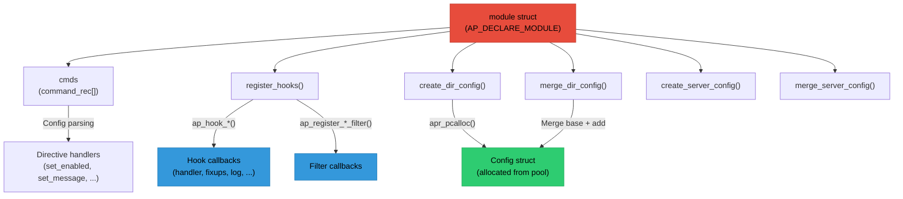

# Chapter 9: Module Anatomy

## What is an Apache Module?

An Apache module is a self-contained unit of functionality that plugs into Apache's core framework. Every feature beyond basic HTTP serving - SSL, compression, URL rewriting, CGI, authentication, session management - is implemented as a module. This chapter brings together everything from the previous chapters (pools, configuration, hooks, filters) to show how they combine into a complete module.

Modules can:

- Add new configuration directives (see [Chapter 4: Configuration](04-configuration.md))
- Handle specific URL paths or file types (via the handler hook)
- Transform content (input/output filters, see [Chapter 7: Filters](07-filters-buckets.md))
- Implement authentication/authorization (via security hooks)
- Add new protocols (via connection hooks)
- Log requests in custom formats (via the log_transaction hook)

## The Module Structure

Every module is defined by the {httpd}`module` structure (from `include/http_config.h`). This single struct is the complete interface between a module and Apache's core - it's how Apache discovers what a module can do:

```c
// include/http_config.h
struct module {
    int version;                    // API version
    int minor_version;              // Minor API version
    int module_index;               // Index in module array
    const char *name;               // Module name
    void *dynamic_load_handle;      // dlopen handle (if dynamic)

    struct module *next;            // Next module in list

    unsigned long magic;            // Magic number for validation

    // Optional initialization function
    void (*rewrite_args)(process_rec *process);

    // Configuration functions
    void *(*create_dir_config)(apr_pool_t *p, char *dir);
    void *(*merge_dir_config)(apr_pool_t *p, void *base, void *add);
    void *(*create_server_config)(apr_pool_t *p, server_rec *s);
    void *(*merge_server_config)(apr_pool_t *p, void *base, void *add);

    // Configuration directives
    const command_rec *cmds;

    // Hook registration function
    void (*register_hooks)(apr_pool_t *p);

    // Flags for module capabilities
    unsigned long flags;
};
```

## The Module Declaration Macro

Modules are declared using the {httpd}`AP_DECLARE_MODULE` macro:

```c
AP_DECLARE_MODULE(example) = {
    STANDARD20_MODULE_STUFF,         // Fills in version, magic, etc.
    create_dir_config,               // Per-directory config creator
    merge_dir_config,                // Per-directory config merger
    create_server_config,            // Per-server config creator
    merge_server_config,             // Per-server config merger
    example_commands,                // Configuration directives
    register_hooks                   // Hook registration function
};
```

The {httpd}`STANDARD20_MODULE_STUFF` macro (from `include/http_config.h`) fills in the boilerplate fields that are the same for every module:

```c
// include/http_config.h
#define STANDARD20_MODULE_STUFF \
    MODULE_MAGIC_NUMBER_MAJOR, \
    MODULE_MAGIC_NUMBER_MINOR, \
    -1,                        /* module_index - filled by ap_add_module() */ \
    __FILE__,                  /* source file name */ \
    NULL,                      /* dynamic_load_handle */ \
    NULL,                      /* next pointer in linked list */ \
    MODULE_MAGIC_COOKIE, \
    NULL,                      /* rewrite_args */ \
    0                          /* flags */
```

The {httpd}`module_struct::module_index` is set to -1 here because it's assigned at runtime by {httpd}`ap_add_module` during module initialization (see [Chapter 6: Hooks](06-hooks.md)). This index is used to index into the per-module config vectors ({httpd}`request_rec::per_dir_config`, {httpd}`request_rec::request_config`, etc.) - each module gets a slot at its unique index.

## Complete Module Example

For a full, annotated module template with configuration directives, handlers, filters, and lifecycle hooks, see the official [Apache Module Development Guide](https://httpd.apache.org/docs/2.4/developer/modguide.html). It covers:

- Configuration structures, creators, and mergers
- Directive handlers and the `command_rec` table
- Hook implementations (handler, post-read, log transaction)
- Output/input filters
- Child init and post-config hooks
- Per-request, per-connection, and per-server config access via {httpd}`ap_get_module_config`
- Logging with {httpd}`ap_log_rerror`, {httpd}`ap_log_error`, and {httpd}`ap_log_cerror`

## Common Patterns

````{dropdown} Getting module config

`ap_get_module_config` takes different config slots depending on the scope you need - per-directory, per-server, per-connection, or per-request.

```c
static int my_handler(request_rec *r)
{
    /* Per-directory config (merged for this request path) */
    my_dir_config *dir = ap_get_module_config(
        r->per_dir_config, &my_module);

    /* Per-server config (for this virtual host) */
    my_server_config *srv = ap_get_module_config(
        r->server->module_config, &my_module);

    /* Per-connection config */
    my_conn_config *conn = ap_get_module_config(
        r->connection->conn_config, &my_module);

    /* Per-request config */
    my_req_data *req = ap_get_module_config(
        r->request_config, &my_module);
}
```
````

````{dropdown} Setting per-request data

A common pattern is to store data early in the request lifecycle (e.g. in a post-read hook) and retrieve it later in the handler, using `r->request_config` as the carrier.

```c
static int my_post_read(request_rec *r)
{
    my_req_data *data = apr_pcalloc(r->pool, sizeof(*data));
    data->start_time = apr_time_now();

    ap_set_module_config(r->request_config, &my_module, data);
    return DECLINED;
}

static int my_handler(request_rec *r)
{
    my_req_data *data = ap_get_module_config(
        r->request_config, &my_module);

    if (data) {
        apr_time_t elapsed = apr_time_now() - data->start_time;
        /* Use elapsed time... */
    }
    return OK;
}
```
````

`````{dropdown} Logging functions and levels

| Function | Scope | Example |
|---|---|---|
| {httpd}`ap_log_rerror` | Request | `ap_log_rerror(APLOG_MARK, APLOG_ERR, 0, r, "Error: %s", msg)` |
| {httpd}`ap_log_error` | Server | `ap_log_error(APLOG_MARK, APLOG_INFO, 0, s, "Initialized")` |
| {httpd}`ap_log_cerror` | Connection | `ap_log_cerror(APLOG_MARK, APLOG_DEBUG, 0, c, "From %s", ip)` |

**Log levels** (least to most verbose): `APLOG_EMERG`, `APLOG_ALERT`, `APLOG_CRIT`, `APLOG_ERR`, `APLOG_WARNING`, `APLOG_NOTICE`, `APLOG_INFO`, `APLOG_DEBUG`, `APLOG_TRACE1`–`APLOG_TRACE8`
`````

## How It All Fits Together

The following diagram shows how the module struct connects to Apache's core systems:



## Summary

A well-structured Apache module includes:

1. **Module declaration** - {httpd}`AP_DECLARE_MODULE` with {httpd}`STANDARD20_MODULE_STUFF`
2. **Configuration structures** - per-directory and per-server config structs
3. **Config creators/mergers** - set defaults, handle inheritance across `<Directory>` nesting
4. **Directive handlers** - parse, validate, and store config values
5. **Command table** - maps directive names to handlers with argument types
6. **Hook implementations** - the actual functionality (handlers, filters, access checks)
7. **Hook registration** - connect callbacks at the right phases and ordering

Key principles:
- Use pools for all allocations (see [Chapter 3: Memory Pools](03-memory-pools.md))
- Return {httpd}`DECLINED` unless you're handling the request
- Use {httpd}`ap_get_module_config()` for configuration access (indexed by `module_index`)
- Register hooks at appropriate ordering (`APR_HOOK_{`{httpd}`FIRST <APR_HOOK_FIRST>`,{httpd}`MIDDLE <APR_HOOK_MIDDLE>`,{httpd}`LAST <APR_HOOK_LAST>``}`)
- Log with {httpd}`ap_log_rerror` (request), {httpd}`ap_log_error` (server), {httpd}`ap_log_cerror` (connection)

```{note}
**For fuzzing:** when you read a module's source to understand what to fuzz, this anatomy tells you exactly where to look. The {httpd}`module_struct::cmds` table tells you what configuration it accepts. The {httpd}`module_struct::register_hooks` function tells you which request phases it participates in. The handler tells you what input it processes. All of these are potential attack surfaces that the fuzzer can exercise.
```