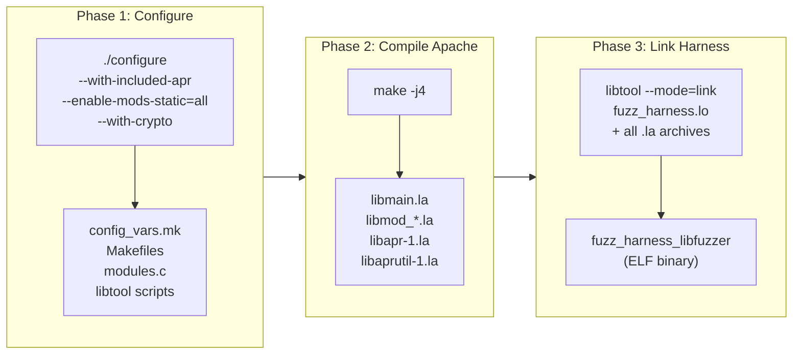
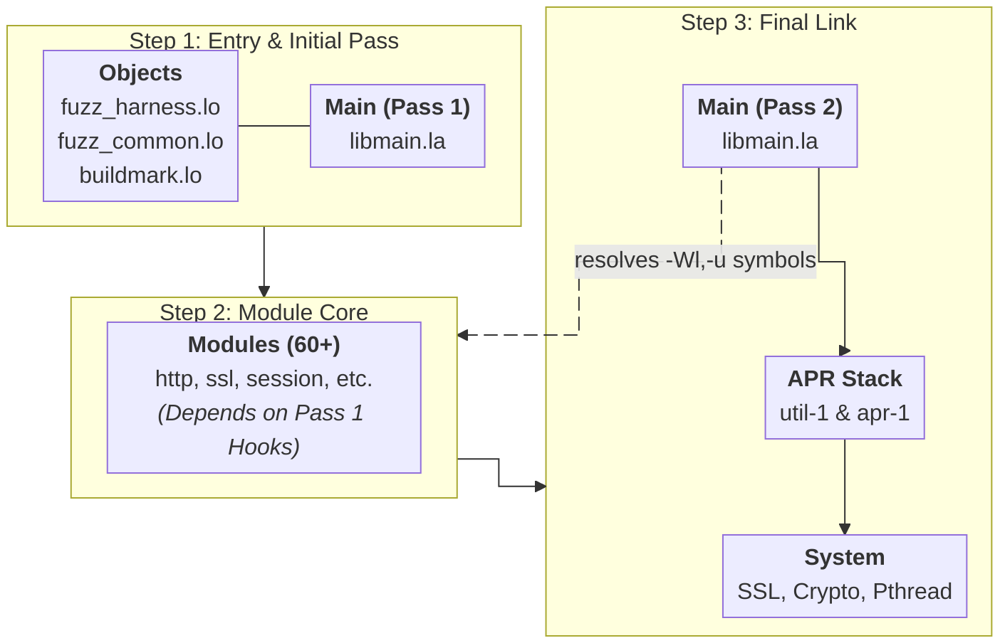
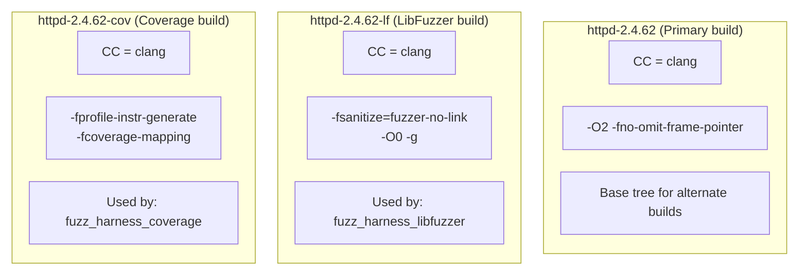

# Building and Linking

Apache HTTPD was designed in the mid-1990s to be built on every Unix variant imaginable, from AIX to Solaris to Linux. That heritage means it uses the full GNU autotools stack -autoconf, automake, and libtool -to abstract away platform differences in compilers, linkers, shared library conventions, and installation paths. For normal users running `./configure && make && make install`, this abstraction is invisible. For anyone trying to link a custom binary against Apache's internals (as we do when building a fuzzing harness), understanding what these tools actually produce and why is essential.

This chapter explains Apache's build system from the perspective of someone who needs to link against it, not someone who just wants to install it. It covers the configure/compile pipeline, the difference between static and dynamic modules and why that distinction matters for fuzzing, libtool's intermediate file formats and wrapper scripts, and the linking strategies required to produce a working fuzzing harness.

## The Build Pipeline

Building Apache from source involves three distinct phases, each producing artifacts that feed into the next. The `apatchy` CLI automates all of this - the {class}`~apatchy.managers.build_manager.BuildManager` class orchestrates the full configure → compile → link pipeline, delegating to {class}`~apatchy.managers.config_manager.ConfigManager` for compiler flag generation, {class}`~apatchy.core.harness.HarnessBuilder` for the link step, and {class}`~apatchy.utils.build_tree.AlternateBuildTree` for hot-patching build files when alternate build trees are needed (see [](#why-hot-patching-is-necessary)). Understanding the pipeline helps when debugging build failures or extending the harness.



**Phase 1 (Configure)** probes the system for compilers, libraries, and platform capabilities, then generates all the Makefiles, a `config_vars.mk` file containing every build variable, a `modules.c` file listing which modules to statically link, and `libtool` scripts configured for the local platform. The configure step is where key decisions are locked in: which compiler to use (`clang` for fuzzing), which modules to build statically versus dynamically, and which optional features to enable (like `--with-crypto` for mod_session_crypto).

**Phase 2 (Compile)** runs `make` to compile all the source files into libtool archives (`.la` files). Apache's server core becomes `server/libmain.la`. Each module becomes `modules/<category>/libmod_<name>.la`. The bundled APR and APR-Util libraries become `srclib/apr/libapr-1.la` and `srclib/apr-util/libaprutil-1.la`. At this point Apache's normal build would also link the `httpd` binary, but we do not need it - we will link our own binary in Phase 3.

**Phase 3 (Link Harness)** is where the fuzzing-specific work happens. We compile the harness source and link it against all the `.la` archives from Phase 2 to produce a single binary that contains the entire Apache server plus the fuzzing entry point. For protobuf-based harnesses, this phase also compiles `.proto` schemas with `protoc`, builds the generated C++ sources, and links against libprotobuf-mutator for structure-aware mutation. This phase is managed by the {class}`~apatchy.core.harness.HarnessBuilder` class rather than Apache's own Makefile.

### Key Configure Options

The {meth}`~apatchy.managers.build_manager.BuildManager.configure_httpd` method assembles these flags automatically - see its docstring for a detailed explanation of each flag. {class}`~apatchy.managers.config_manager.ConfigManager` generates the `CFLAGS`/`LDFLAGS` based on the selected sanitizer options, while the {mod}`~apatchy.compat` module adds version-specific compatibility flags for the detected HTTPD version.

## Static vs Dynamic Modules

Apache supports two ways of including modules: statically linked into the binary, or dynamically loaded at runtime as shared objects (`.so` files). This choice has significant implications for fuzzing.

`````{tab-set}

````{tab-item} Dynamic Modules (DSO)

In a production deployment, most modules are built as Dynamic Shared Objects and loaded at runtime through `LoadModule` directives:

```apache
LoadModule rewrite_module modules/mod_rewrite.so
LoadModule ssl_module modules/mod_ssl.so
```

This approach is flexible - you can enable or disable modules by editing the config file, and you can upgrade individual modules without rebuilding the entire server. Apache's `apxs` tool exists specifically to build third-party modules this way:

```bash
# Compile, install, and activate a module
apxs -c -i -a mod_example.c

# Compile with external library dependencies
apxs -c -I/usr/include/libxml2 -lxml2 mod_example.c helper.c
```
````

````{tab-item} Static Modules

Static modules are compiled directly into the binary. Configure generates a `modules.c` file that lists every statically linked module in two arrays:

```c
// modules.c (auto-generated by configure)
module *ap_prelinked_modules[] = {
    &core_module,
    &http_module,
    &rewrite_module,
    &ssl_module,
    &session_module,
    &session_crypto_module,
    // ... 60+ modules when --enable-mods-static=all
    NULL
};
```

Apache walks this array during startup to register each module's hooks, directives, and configuration handlers. No `LoadModule` directives are needed.
````

`````

### Why Static Linking is Better for Fuzzing

The fuzzing harness uses `--enable-mods-static=all` for three reasons that are each independently sufficient:

1. **Consistent SanCov instrumentation.** LibFuzzer relies on SanCov callbacks inserted at compile time. Static linking lets the compiler instrument the harness, Apache core, and all modules in a single pass. Dynamic modules would need separate compilation with identical flags.

2. **No wrapper scripts.** With shared APR libraries, libtool generates shell wrapper scripts instead of ELF binaries. `--disable-shared` produces the binary directly.

3. **Single binary.** One self-contained ELF - no `LD_LIBRARY_PATH`, no `modules/` directory, trivial crash reproduction on any machine.


## Understanding Libtool

Libtool is an abstraction layer over platform-specific shared library tooling. On Linux you might use `gcc -shared -o libfoo.so`, on macOS it is `libtool -dynamic -o libfoo.dylib`, and on older systems the flags are entirely different. Libtool provides a uniform interface and generates intermediate files that track dependencies between libraries. Apache uses libtool pervasively, and the fuzzing harness must use the same libtool instance (found at `srclib/apr/libtool`) to link correctly.

### .lo Files (Libtool Objects)

When libtool compiles a source file, it produces a `.lo` file rather than a plain `.o` file. The `.lo` file is a small text file that points to the actual compiled objects:

```
# fuzz_harness.lo
pic_object='.libs/fuzz_harness.o'    # Position-independent (for shared libraries)
non_pic_object='fuzz_harness.o'       # Non-PIC (for static archives)
```

Libtool compiles the source file twice - once with `-fPIC` for use in shared libraries, once without for static archives - and the `.lo` file records both results. When you later tell libtool to link, it picks the appropriate object based on whether it is building a shared library or a static executable.

### .la Files (Libtool Archives)

A `.la` file describes a library and its dependencies. It is also a text file, not a binary:

```
# server/libmain.la
dlname='libmain.so.0'
library_names='libmain.so.0.0.0 libmain.so.0 libmain.so'
old_library='libmain.a'
dependency_libs=' -L/usr/lib -lpthread -ldl -lpcre2-8'
libdir='/usr/local/apache2/lib'
```

The critical field is `dependency_libs`: it lists every library that `libmain.la` depends on. When you link against `libmain.la`, libtool reads this field and transitively pulls in all the dependencies. This is what makes libtool linking "just work" in the common case - you specify the top-level `.la` file and libtool figures out the full dependency chain.

For the fuzzing harness, this transitive dependency resolution is essential. Apache's module libraries depend on Apache's core library, which depends on APR-Util, which depends on APR, which depends on system libraries. Specifying the `.la` files (rather than raw `.a` or `.so` files) lets libtool sort out the full chain.

### Binary Output Location

Because APR and APR-Util are built as static-only libraries (`--disable-shared`), libtool places the harness binary directly in the working directory - no wrapper scripts, no `.libs/` indirection:

```bash
$ file fuzz_harness_libfuzzer
fuzz_harness_libfuzzer: ELF 64-bit LSB executable, x86-64, dynamically linked...
```

You can run the binary directly:

```bash
./fuzz_harness_libfuzzer corpus/
```

The `apatchy fuzz` command handles this automatically.

```{note}
If you see a libtool wrapper script instead of an ELF binary (e.g. after building with shared APR), the real binary will be inside `.libs/`. The `apatchy` CLI checks both locations automatically.
```

## Linking the Fuzzing Harness Against Apache

Linking the fuzzing harness is the most involved part of the build. The harness must link against Apache's server core, every statically-built module, APR-Util, APR, and various system libraries - and the order in which these are specified matters.

### The Compile Step

Each source file is compiled through Apache's own libtool instance to ensure consistent flags and object formats. For non-proto harnesses (`.c` files), the pipeline compiles three source files:

```bash
LIBTOOL=../httpd-2.4.62/srclib/apr/libtool

# Compile the harness
$LIBTOOL --mode=compile clang -c \
    -I../httpd-2.4.62/include \
    -I../httpd-2.4.62/srclib/apr/include \
    -I../httpd-2.4.62/srclib/apr-util/include \
    -I../httpd-2.4.62/os/unix \
    -I../httpd-2.4.62/server \
    mod_fuzzy.c -o fuzz_harness.lo

# Compile fuzz_common.c (shared initialization, hooks, filters)
$LIBTOOL --mode=compile clang -c \
    fuzz_common.c -o fuzz_common.lo

# Compile buildmark.c (provides ap_get_server_built() symbol)
$LIBTOOL --mode=compile clang -c \
    ../httpd-2.4.62/server/buildmark.c -o buildmark.lo

# Compile modules.c (provides ap_prelinked_modules array)
$LIBTOOL --mode=compile clang -c \
    ../httpd-2.4.62/modules.c -o modules.lo
```

- **mod_fuzzy.c** (or any harness `.c`/`.cc`) - the harness entry point
- **fuzz_common.c** - shared infrastructure (Apache initialization, I/O filters, fake MPM, socketless operation)
- **buildmark.c** - a small Apache source file that provides the `ap_get_server_built()` function, which Apache's core calls during startup
- **modules.c** - the auto-generated file listing all statically linked modules

Proto harnesses (`.cc` files) have a more complexity in their compile step - see [](#protobuf-harness-compilation) for details.

### Include Paths

The harness needs headers from four separate directory trees:

```bash
-I../httpd-2.4.62/include            # Apache core headers (httpd.h, http_config.h, etc.)
-I../httpd-2.4.62/srclib/apr/include  # APR headers (apr.h, apr_pools.h, etc.)
-I../httpd-2.4.62/srclib/apr-util/include  # APR-Util headers (apr_buckets.h, etc.)
-I../httpd-2.4.62/os/unix            # Platform-specific headers (os.h, unixd.h)
-I../httpd-2.4.62/server             # Server internal headers (mpm_common.h)
```

### The Link Step and Dependency Order

The order of which we link the objects matters. Below is a sample command that demonstrates it: 

```bash
$LIBTOOL --mode=link clang \
    -Wl,-z,muldefs \
    -Wl,-u,ap_cookie_write \
    -Wl,-u,ap_cookie_read \
    -Wl,-u,ap_cookie_check_string \
    -Wl,-u,ap_rxplus_compile \
    -Wl,-u,ap_rxplus_exec \
    -o fuzz_harness_libfuzzer \
    fuzz_harness.lo fuzz_common.lo buildmark.lo modules.lo \
    -export-dynamic \
    ../server/libmain.la \                # (1) Server core - first pass
    ../os/unix/libos.la \
    ../server/mpm/event/libevent.la \
    ../modules/http/libmod_http.la \      # (2) All module libraries
    ../modules/ssl/libmod_ssl.la \
    ../modules/proxy/libmod_proxy.la \
    ... (60+ module libraries) ...
    ../server/libmain.la \                # (3) Server core - second pass
    ../os/unix/libos.la \
    ../srclib/apr-util/libaprutil-1.la \  # (4) APR-Util
    ../srclib/apr/libapr-1.la \           # (5) APR (foundational)
    -lssl -lcrypto -lz -lpcre2-8 \       # (6) System libraries
    -luuid -lcrypt -lpthread
```

There is a lot going on in this link command. Let's break it down.

### Why Link Order Matters

When the linker processes a static archive (`.a` file), it does not include every object in the archive. It scans the archive and only pulls in object files that resolve currently-undefined symbols. Once it finishes scanning, it moves on and never comes back. This means that if Library A depends on Library B, **B must come after A** on the command line -otherwise the linker will scan B before it knows that any of B's symbols are needed, skip everything, and then fail with undefined references when it reaches A.

This is a fundamental property of the Unix static linker and is the source of most "undefined reference" errors when linking against Apache.

### Why Circular Dependencies Happen in Apache

Apache's architecture creates genuine circular dependencies between its libraries. The `libmain.la` archive contains the server core: configuration parsing, hook dispatch, pool management wrappers, and various utility functions. Module libraries (like `libmod_session.la`) depend on `libmain.la` for functions like `ap_hook_*`, {httpd}`ap_get_module_config()`, and {httpd}`ap_log_rerror()`.

But the dependency runs the other direction too. Module archives reference utility functions that live inside `libmain.a` - for example, `mod_session` calls `ap_cookie_write()`, which is defined in `util_cookies.o` (one of the many `.o` files packed into `libmain.a`). The problem: when the linker scans `libmain.a` on the first pass, no one has asked for `ap_cookie_write` yet, so the linker skips `util_cookies.o` entirely. Later, when the module archives create the undefined reference, the linker has already moved past `libmain.a`.

The solution has two parts:

1. **List `libmain.la` twice** - once before the module libraries (so modules can resolve their core dependencies) and once after (so the linker gets a second chance to pull utility functions that modules referenced).

2. **Force-pull specific symbols** with `-Wl,-u,<symbol>` - this marks symbols as undefined from the start, guaranteeing they get pulled from the archive even if no object file has referenced them yet. The five symbols currently forced are `ap_cookie_write`, `ap_cookie_read`, `ap_cookie_check_string`, `ap_rxplus_compile`, and `ap_rxplus_exec`.

```{note}
The number of `-Wl,-u` entries depends on how many Apache functions the harness references. The harness and `fuzz_common.c` drive the first pass of `libmain.a` - every function they call pulls in `.o` files, and each pulled `.o` may transitively pull in others. A minimal harness that only calls `ap_process_connection()` would leave many more symbols unresolved than one that also calls config parsing, filter registration, etc.

In practice, `fuzz_common.c` is heavy enough to pull in most of `libmain.a` through transitive references. The five `-Wl,-u` symbols are the stragglers that nothing in the harness's transitive chain touches. If a new module causes an "undefined reference" at link time for a function inside `libmain.a`, adding another `-Wl,-u` to the `muldefs_flags` list in {class}`~apatchy.core.harness.HarnessBuilder` is the fix.
```



- **The `-Wl,-z,muldefs` flag** - Both the harness and `libmain.la` define `main()`. This flag tells the linker to use the first definition it encounters (the harness's `main()` via `fuzz_harness.lo`) and silently ignore Apache's `main()` in `libmain.a`.

- **The `-export-dynamic` flag** - Some Apache modules use `dlsym()` to look up symbols in the main executable at runtime. This flag adds all symbols to the dynamic symbol table so that `dlsym(RTLD_DEFAULT, ...)` calls succeed.

### System Library Dependencies

The system libraries at the end of the link line come from two sources:

1. **Apache's `config_vars.mk`** - during configure, Apache probes for system libraries and records which modules need what. The build script parses all `MOD_*_LDADD` variables from this file to collect flags like `-lssl`, `-lcrypto`, `-lz`, `-lxml2`, etc.

2. **Always-needed libraries** -`-lpthread` (threading), `-ldl` (dynamic loading), `-lcrypt` (crypt functions), and `-luuid` (UUID generation) are required regardless of which modules are enabled.

(protobuf-harness-compilation)=
### Protobuf Harness Compilation

Proto harnesses (`.cc` files) use libprotobuf-mutator for structure-aware fuzzing and have a more involved compile pipeline than plain C harnesses. Each proto harness declares its dependencies via `@protos` and `@converters` tags in its header comment:

```cpp
/*
 * @description: proto harness - mod_session_crypto fuzzing
 * @protos: http_request, session_crypto
 * @converters: http, session_crypto
 */
```

The {class}`~apatchy.core.harness.HarnessBuilder` parses these tags and only compiles the needed files. The full pipeline:

1. **protoc** generates `.pb.h`/`.pb.cc` from all `.proto` schemas (protoc needs all files to resolve imports, but only the declared protos are compiled)
2. **Compile `.pb.cc`** - only the protos listed in `@protos` are compiled with `clang++`
3. **Compile harness `.cc`** - via libtool with `clang++` (needs Apache includes + proto gen dir + LPM includes)
4. **Compile proto converters** - only the converters listed in `@converters` from the `proto_converters/` directory
5. **Compile C files** -`fuzz_common.c`, `fuzz_backend.c`, `buildmark.c`, `modules.c` via libtool with `clang`
6. **Link with `clang++`** - adds libprotobuf-mutator (`-lprotobuf-mutator-libfuzzer -lprotobuf-mutator`), protobuf runtime (`-lprotobuf`), and all Apache `.la` archives


## Alternate Build Trees

The fuzzer needs multiple copies of Apache compiled with different flags. The vanilla root tree is built with `clang -g -O0` for debugging, but LibFuzzer and coverage branches each need their own instrumentation flags (`-fsanitize=fuzzer-no-link` and `-fprofile-instr-generate` respectively). These cannot coexist in the same binary.

Rather than re-running `configure` (which would regenerate `modules.c` and destroy the build state), the {class}`~apatchy.utils.build_tree.AlternateBuildTree` utility creates a full copy of the source tree, rewrites all the hardcoded absolute paths in Makefiles and `.la` files to point at the copy, patches the compiler and flag variables, and rebuilds. The result is a parallel tree like `httpd-2.4.62-lf/` that can be used for LibFuzzer-instrumented linking without disturbing the root.



This design means you can fuzz with LibFuzzer in one terminal and generate coverage reports in another without either operation interfering with the other.

### Why Hot-Patching Is Necessary

Apache's `configure` script bakes absolute paths, compiler names, and compiler flags into dozens of files scattered across the build tree. When you run `./configure CC=clang CFLAGS="-O2 -fsanitize=address ..."`, those values are written verbatim into:

- **`config_vars.mk`** and other `.mk` files (`apr_rules.mk`, `rules.mk`) - the central repositories for `CC`, `CPP`, `CFLAGS`, `LDFLAGS`, `NOTEST_CFLAGS`, and `EXTRA_CFLAGS`
- **`libtool` scripts** (one per library subtree: top-level, `srclib/apr/`, `srclib/apr-util/`) - contain their own `CC`, `LTCC`, and `LTCFLAGS` variables
- **`Makefile` files** - reference `CPP` and other variables directly
- **`.la` files** - contain hardcoded `libdir` paths and `dependency_libs` with absolute paths
- **`config.status`**, **`config.nice`**, **`config.log`** - record the original configure invocation with full paths

There is no `configure` option to change the compiler after the fact. Re-running `configure` would regenerate `modules.c`, potentially change which modules are enabled, and destroy the carefully tuned build state. The only viable approach is to copy the tree and surgically patch the build files in place - hence the name *apatchy*.

### The Two-Phase Patching Strategy

The {class}`~apatchy.utils.build_tree.AlternateBuildTree` class manages this with two distinct patching passes, implemented as {meth}`~apatchy.utils.build_tree.AlternateBuildTree.rewrite_paths` and {meth}`~apatchy.utils.build_tree.AlternateBuildTree.patch_build_flags`.

**Phase 1: Path Rewriting** ({meth}`~apatchy.utils.build_tree.AlternateBuildTree.rewrite_paths`) - After the copy, every build file still contains hardcoded paths pointing at the original tree. A string replacement rewrites these across all Makefiles, `.mk` files, `config.status`, `config.nice`, `config.log`, `libtool` scripts, and `.la` files. Without this, `make` in the copy would read/write objects in the original tree.

**Phase 2: Flag Patching** ({meth}`~apatchy.utils.build_tree.AlternateBuildTree.patch_build_flags`) - With paths fixed, the compiler and flags still reference the root's settings. Regex substitution patches `CC`, `CFLAGS`, `LDFLAGS` across libtool scripts, `.mk` config files, and Makefiles. It also clears `NOTEST_CFLAGS`/`EXTRA_CFLAGS` which carry `-Werror` flags that may clash with different instrumentation options.

```{note}
`LDFLAGS` is only patched in config files, never passed on the `make` command line. Command-line `LDFLAGS` would clobber the Makefile variable globally, breaking libtool's transitive dependency resolution - support utilities would lose `-lcrypt`, `-lm`, and other system libraries they need.
```

## Compiler and Linker Flags Reference

Flags vary by tree type. The vanilla root and coverage branch use debug flags; the libfuzzer branch uses optimized flags with SanCov instrumentation.

````{dropdown} CFLAGS
```bash
# Vanilla root (apatchy configure)
-g                          # Debug symbols
-O0                         # No optimization (readable stack traces)
-fno-omit-frame-pointer     # Complete stack traces in ASan reports
-Wno-error=format           # Suppress format warnings from clang

# LibFuzzer branch (apatchy make --tree lf)
-fsanitize=fuzzer-no-link   # SanCov instrumentation for coverage-guided fuzzing
-Wno-error                  # Suppress all -Werror from configure

# Coverage branch (apatchy make --tree cov)
-fprofile-instr-generate    # LLVM coverage instrumentation
-fcoverage-mapping          # Source-level coverage mapping

# Harness-level (added by HarnessBuilder during link)
-DLIBFUZZER                 # Compile harness with LLVMFuzzerTestOneInput entry point
-fsanitize=fuzzer           # Link LibFuzzer runtime into the binary

# Platform defines (set by configure)
-DLINUX -D_GNU_SOURCE -D_REENTRANT -DHAVE_CONFIG_H

# Sanitizer flags (orthogonal, combined with any tree)
-fsanitize=address          # AddressSanitizer (heap/stack overflow, use-after-free)
-fsanitize=undefined        # UndefinedBehaviorSanitizer
-fsanitize-recover=all      # Continue after UBSan reports (ASan still aborts)
-fno-sanitize-trap          # Emit runtime report instead of trap instruction
```
````

````{dropdown} LDFLAGS
```bash
# Sanitizer flags (must match CFLAGS)
-fsanitize=address
-fsanitize=undefined

# All trees
-no-pie                     # Avoid R_X86_64_32S relocation errors from SanCov

# Harness-specific
-Wl,-z,muldefs              # Allow duplicate main() definitions
-Wl,-u,ap_cookie_write      # Force-pull symbols from libmain.a
-Wl,-u,ap_cookie_read
-Wl,-u,ap_cookie_check_string
-Wl,-u,ap_rxplus_compile
-Wl,-u,ap_rxplus_exec
-export-dynamic              # Export symbols for dlsym() lookups

# Coverage branch
-fprofile-instr-generate    # Must also be in LDFLAGS for coverage
```
````

````{dropdown} System Libraries
```bash
-lpthread       # POSIX threads (APR threading)
-ldl            # Dynamic loading (mod_so, dlopen)
-lcrypt         # crypt() function
-luuid          # UUID generation
-lssl -lcrypto  # OpenSSL (mod_ssl, mod_session_crypto)
-lz             # zlib (mod_deflate)
-lpcre2-8       # PCRE2 (regex in RewriteRule, LocationMatch, etc.)
-lxml2          # libxml2 (mod_proxy_html, mod_xml2enc)
-llua5.4        # Lua (mod_lua)
```
````

