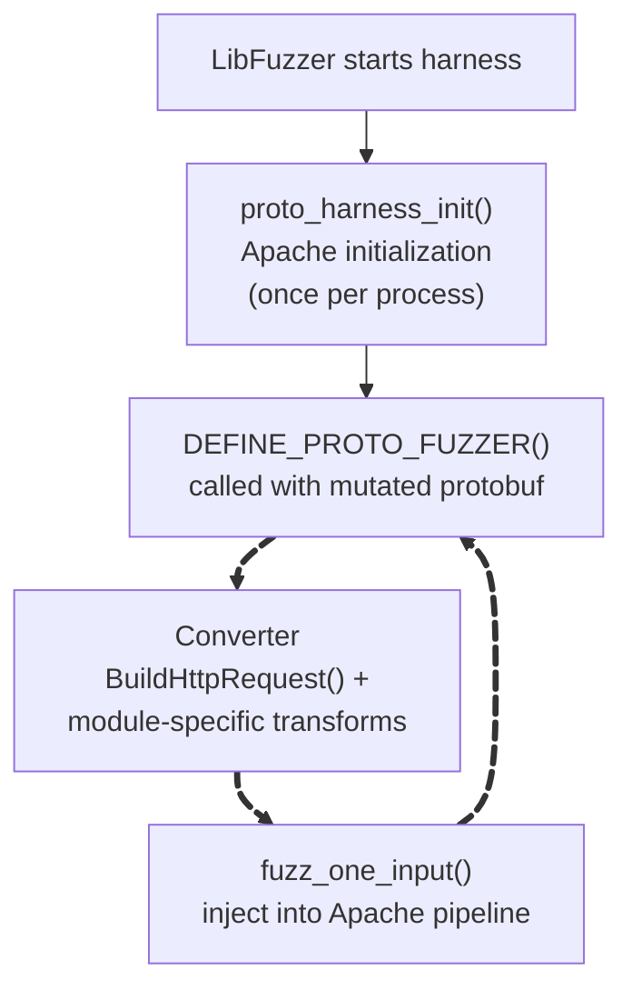

# Fuzzing Engine Integration

This page covers how the harness integrates with each supported fuzzing engine. For the harness internals (filter replacement, fake connections, input handling), see [Harness Design](harness-design.md).

## LibFuzzer with libprotobuf-mutator

The framework uses LibFuzzer with [libprotobuf-mutator](https://github.com/google/libprotobuf-mutator) (LPM) for structure-aware fuzzing. Instead of mutating raw bytes, LPM mutates protobuf messages that describe HTTP requests, then a converter translates each message into raw HTTP bytes before feeding it to Apache.

### Why protobuf?

Raw byte mutation is bad at producing valid HTTP requests. Most mutations break the request line or headers, and Apache rejects them before reaching any module code. Protobuf-based mutation operates on structured fields (method, URI, headers, body) independently, producing syntactically valid requests that exercise deeper code paths.

### Architecture

Each proto harness has three layers:

```
LibFuzzer -> LPM (mutates protobuf message) -> Converter (proto -> raw HTTP) -> fuzz_one_input()
```



### The proto harness entry point

LPM provides the `DEFINE_PROTO_FUZZER` macro which replaces LibFuzzer's `LLVMFuzzerTestOneInput`. It automatically handles deserialization and structure-aware mutation:

```cpp
DEFINE_PROTO_FUZZER(const SessionCryptoRequest &request)
{
    if (!proto_harness_init())
        return;

    std::string raw = BuildHttpRequest(request.http());
    ApplySessionCrypto(request.cookie(), request.route(), raw);
    fuzz_one_input(raw.data(), raw.size());
}
```

1. **`proto_harness_init()`** - initializes Apache once (config parsing, module hooks, memory pools). Reads `FUZZ_CONF` and `FUZZ_ROOT` environment variables.
2. **`BuildHttpRequest()`** - converts the protobuf `HttpRequest` message into a raw HTTP request string (method line, headers, body).
3. **Module-specific transforms** (e.g. `ApplySessionCrypto()`) - apply module-specific mutations like encrypting session cookies, constructing multipart boundaries, or injecting rewrite-targeted URIs.
4. **`fuzz_one_input()`** - injects the raw bytes into Apache's bucket brigade and runs the full request pipeline.

### Proto schemas

Each harness declares its proto dependencies via `@protos` and `@converters` tags (see [](#protobuf-harness-compilation) in the building chapter). Available schemas:

| Proto | Message | Used by |
|-------|---------|---------|
| `http_request` | `HttpRequest` | All harnesses (base HTTP fields) |
| `session_crypto` | `SessionCryptoRequest` | `mod_fuzzy_proto_session` |
| `multipart_request` | `MultipartRequest` | `mod_fuzzy_proto_multipart` |
| `pwn_request` | `PwnRequest` | `mod_fuzzy_proto_pwn` |
| `rewrite_request` | `RewriteRequest` | `mod_fuzzy_proto_rewrite` |
| `uwsgi_req_res` | `UwsgiRequest` | `mod_fuzzy_proto_uwsgi` |

### Seeds

LPM accepts seeds in `.textproto` (human-readable) or binary protobuf format. Text seeds are easier to write and review:

```protobuf
# fuzz-seeds/basic.textproto
http {
  method: "GET"
  uri: "/"
  headers { key: "Host" value: "localhost" }
}
```

### Binaries

The build produces two binaries:

- **`fuzz_harness_libfuzzer`** - linked against the `-lf` tree with SanCov instrumentation. Used for fuzzing.
- **`fuzz_harness_coverage`** - linked against the `-cov` tree with LLVM coverage instrumentation. Used for crash triage and coverage reports.

``````{dropdown} AFL++ (deprecated - removed in v0.2.0-alpha)
```{important}
AFL++ support was removed in `v0.2.0-alpha`. The section below is kept for reference but is not functional. AFL++ support may be re-added in a future release.
```

The harness used AFL++'s **persistent mode** for maximum throughput:

1. **Process startup**: Apache initialization (config parsing, module hooks, memory pools) - expensive, happens once.
2. **Fork server**: `__AFL_INIT()` establishes the fork server. AFL++ uses the initialized process as a template.
3. **Persistent loop**: `__AFL_LOOP(10000)` reuses the same forked process for 10,000 inputs before exiting and forking fresh.

The implementation used shared-memory test cases to eliminate file I/O overhead:

```c
#ifdef __AFL_HAVE_MANUAL_CONTROL
    __AFL_INIT();
    unsigned char *buf = __AFL_FUZZ_TESTCASE_BUF;
    while (__AFL_LOOP(10000)) {
        int len = __AFL_FUZZ_TESTCASE_LEN;
        fuzz_one_input((const char *)buf, len);
    }
#endif
```
``````

## Configuration

The harness loads Apache configuration using the same mechanism as regular httpd:

1. **Server root** (`FUZZ_ROOT` env var or `-d` flag): Base directory for relative paths in the config
2. **Config file** (`FUZZ_CONF` env var or `-f` flag): The Apache configuration to load
3. **Static modules**: All modules are compiled into the binary, so no `LoadModule` directives are needed for built-in modules

Minimal fuzzing config:

```apache
ServerName localhost:80
HttpProtocolOptions Unsafe           # Relax strict HTTP parsing for fuzz input
RequestReadTimeout handshake=0 header=0 body=0  # No timeouts (no real socket)
DocumentRoot "/tmp/htdocs"
<Directory "/">
    Require all granted              # No authentication checks
</Directory>
```

`HttpProtocolOptions Unsafe` is important - without it, Apache's strict HTTP parser rejects many fuzz inputs before they reach any module code. Since we're fuzzing for memory safety bugs (not protocol compliance), relaxing the parser maximizes code coverage.

## ASan Integration

When built with AddressSanitizer, the harness needs special handling:

- **Signal handler restoration**: ASan installs its own signal handlers (SIGSEGV, SIGBUS, etc.) but Apache overwrites them during initialization. The harness saves and restores ASan's handlers after Apache init so crashes are properly reported.
- **Pool debug mode**: `--enable-pool-debug=yes` makes `apr_palloc()` use direct `malloc()` so ASan can track individual allocations. See the [memory pools](../apache-internals/03-memory-pools.md) chapter for details.
- **Coverage flush**: `fuzz_exit()` calls `__llvm_profile_write_file()` before `_exit()` to flush coverage data, since Apache's `mod_watchdog` threads can deadlock during normal `atexit` cleanup.
