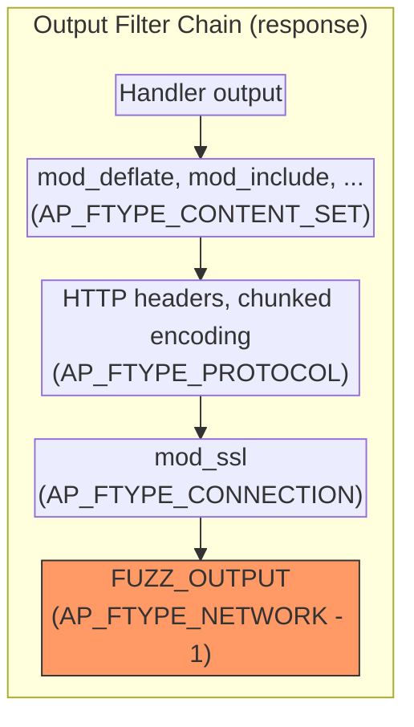
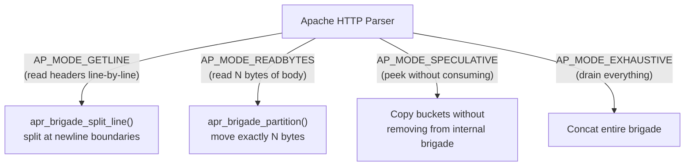

# Harness Design

This document explains how the fuzzing harness works - the design decisions behind replacing Apache's network I/O layer with in-memory filters. For Apache internals background, see the [Apache Internals](../apache-internals/README.md) guide. For the fuzzing engine and protobuf integration, see [Fuzzing Engines](fuzzing-engines.md).

## Goal

Feed arbitrary bytes to Apache's full request processing pipeline - HTTP parsing, hook phases, module handlers, filter chains - without network I/O. The harness needs to be fast enough for coverage-guided fuzzing (thousands of executions per second) while running the exact same code paths as a production Apache server.

## Where the Harness Fits in Apache's Filter Stack

Apache processes all I/O through **filters** - composable functions arranged in a chain, each assigned a **type** that determines its position. Types range from {httpd}`AP_FTYPE_RESOURCE` (content generation, at the top) down to {httpd}`AP_FTYPE_NETWORK` (raw socket I/O, at the bottom). Data flows down through the chain for responses and up for requests. For a full explanation of filter types, bucket brigades, and how to write filters, see [Chapter 7: Filters and Bucket Brigades](../apache-internals/07-filters-buckets.md).

We only replace the bottom of the stack - where Apache would normally read from and write to a socket. Everything above that (SSL, HTTP protocol framing, content compression, module-specific processing) runs exactly as it would in production:



`FUZZ_INPUT` is registered at {httpd}`AP_FTYPE_NETWORK` and `FUZZ_OUTPUT` at `AP_FTYPE_NETWORK - 1`. From the perspective of every other filter in the chain, the data source and sink look identical to a real socket.

## Architecture Overview

The following diagram shows how fuzz input flows from LibFuzzer through the proto converter, into Apache's request pipeline, and back:

```{image} /_static/images/fuzzer-architecture.drawio.svg
```

The harness does a few things that are non-obvious:

1. **Replaces network I/O** with custom filters and a bucket injection hook
2. **Discriminates connections** - fuzz client connections get in-memory I/O, proxy backend connections use real sockets
3. **Provides a fake MPM** so Apache thinks it's running inside the event MPM
4. **Manages the connection lifecycle** - creates a `conn_rec`, runs the pipeline, destroys the pool, repeat

All of this lives in `fuzz_common.c`. The proto harnesses (`.cc` files) and converters sit on top and just call `fuzz_one_input()` with raw HTTP bytes.

## Key Design Decisions

### 1. Filter Registration

During `fuzz_init()`, we register two filters and two hooks:

```c
fuzz_input_filter_handle =
    ap_register_input_filter("FUZZ_INPUT", fuzz_input_filter, NULL, AP_FTYPE_NETWORK);

fuzz_output_filter_handle =
    ap_register_output_filter("FUZZ_OUTPUT", fuzz_output_filter, NULL, AP_FTYPE_NETWORK - 1);

ap_hook_pre_connection(fuzz_pre_connection, NULL, NULL, APR_HOOK_REALLY_FIRST);
ap_hook_insert_network_bucket(fuzz_insert_network_bucket, NULL, NULL, APR_HOOK_FIRST);
```

We store the filter handles and add them to each connection in `pre_connection` - not at registration time. The `insert_network_bucket` hook is how we inject fuzz data into the bucket brigade instead of reading from a socket.

### 2. Connection Discrimination

Not all connections in the harness are fuzz targets. When fuzzing proxy modules (`mod_proxy_uwsgi`, etc.), Apache creates backend connections to the upstream server. We need those to use real socket I/O (or our backend mock), not the fuzz input buffer.

The solution: we tag fuzz client connections with a note in `fuzz_one_input()`:

```c
apr_table_setn(c->notes, "fuzz_client", "1");
```

Then both `fuzz_pre_connection` and `fuzz_insert_network_bucket` check for this note. If it's missing, they return `DECLINED` and let the normal socket path handle it.

### 3. Pre-Connection Hook

`fuzz_pre_connection` runs at `APR_HOOK_REALLY_FIRST` and does the actual I/O replacement for tagged connections:

```c
static int fuzz_pre_connection(conn_rec *c, void *csd)
{
    if (!apr_table_get(c->notes, "fuzz_client"))
        return DECLINED;

    fuzz_net_rec *net = apr_pcalloc(c->pool, sizeof(*net));
    net->c = c;
    net->bb = apr_brigade_create(c->pool, c->bucket_alloc);

    ap_set_core_module_config(c->conn_config, g_dummy_socket);
    ap_add_input_filter_handle(fuzz_input_filter_handle, net, NULL, c);
    ap_add_output_filter_handle(fuzz_output_filter_handle, NULL, NULL, c);

    c->master = c;
    return OK;
}
```

A few things to note:

- **`g_dummy_socket`** is created once in `fuzz_init()` and reused for every connection. `core_pre_connection` calls `apr_socket_opt_set(csd, ...)` which would crash on NULL, so we need a real (but unconnected) socket.
- **`c->master = c`** makes `core_pre_connection` think this is a secondary connection (like an HTTP/2 stream) and skip its own socket filter registration. Without this, core would try to read socket metadata from our dummy socket and fail. This trick is a cursed CTF tactic, but it works! :D 
- **Returns `OK`**, not `DONE`. This is important - returning `DONE` would stop the hook chain and prevent other modules (mod_remoteip, mod_logio, etc.) from running their `pre_connection` hooks.

### 4. The `fuzz_one_input()` Lifecycle

This is the function that proto converters call after building the raw HTTP bytes. Each call creates a fresh connection, runs it through Apache, and tears it down:

```c
int fuzz_one_input(const char *data, size_t size)
{
    // Set global input buffer (read by the input filter)
    g_input_data = (char *)data;
    g_input_size = size;

    // Create a transaction pool (destroyed after this request)
    apr_pool_create(&ptrans, g_pconf);

    // Build a conn_rec with fake loopback addresses
    c = apr_pcalloc(ptrans, sizeof(*c));
    c->local_addr = create_fake_sockaddr(ptrans, "127.0.0.1", 80);
    c->client_addr = create_fake_sockaddr(ptrans, "127.0.0.1", 12345);

    // Tag as fuzz client so our hooks intercept it
    apr_table_setn(c->notes, "fuzz_client", "1");

    // Run the full Apache pipeline
    ap_process_connection(c, g_dummy_socket);

    // Cleanup
    apr_pool_destroy(ptrans);
    g_input_data = NULL;
    return 0;
}
```

The transaction pool (`ptrans`) is key to performance - destroying it frees all memory allocated during the request in one shot, including bucket allocators, filter contexts, and request data. No individual `free()` calls needed.

(harness-input-filter)=
### 5. Input Filter: Handling Apache's Read Modes

The input filter is the most complex part because Apache's HTTP parser uses multiple read modes. The parser calls {httpd}`ap_get_brigade` with different {httpd}`ap_input_mode_t` flags depending on what it's reading:



`AP_MODE_GETLINE` is the tricky one - Apache reads headers one line at a time by requesting data up to the next `\n`. If the input filter returns the entire buffer at once, the parser fails with "Invalid whitespace in request" errors. We use `apr_brigade_split_line` to split correctly at line boundaries.

On first read, the filter populates its internal brigade from the global `g_input_data` buffer and appends an EOS bucket. Subsequent reads consume from this internal brigade until it's empty.

(harness-output-filter)=
### 6. Output Filter

The output filter iterates over the response bucket brigade. In `LIBFUZZER` mode, output is discarded (we're looking for crashes, not checking responses). In non-libfuzzer builds, it writes to stdout for debugging:

```c
rv = apr_bucket_read(b, &data, &len, APR_BLOCK_READ);
#if !defined(LIBFUZZER)
if (rv == APR_SUCCESS && len > 0)
    fwrite(data, 1, len, stdout);
#endif
```

### 7. Backend Mocking (fuzz_backend.c)

For harnesses that fuzz proxy modules (like `mod_fuzzy_proto_uwsgi`), we need to mock the backend server response. `fuzz_backend.c` provides this - it hooks `pre_connection` for non-fuzz-client connections (the proxy backend side) and serves a pre-prepared response buffer instead of connecting to a real upstream.

The harness enables this by setting `fuzz_extra_hooks` to register the backend hooks:

```c
fuzz_extra_hooks = apatchy_register_backend_hooks;
```

### 8. Coverage-Safe Exit

`fuzz_exit()` handles a subtle problem: LLVM coverage data (`.profraw` files) is normally written via `atexit` handlers, but we use `_exit()` instead of `exit()` to avoid deadlocking on `mod_watchdog` threads that Apache spawns. So we manually call `__llvm_profile_write_file()` before `_exit()`:

```c
void fuzz_exit(int status)
{
    fflush(stdout);
    if (__llvm_profile_write_file)
        __llvm_profile_write_file();
    _exit(status);
}
```

The `__llvm_profile_write_file` symbol is a weak reference - it resolves to the real function in coverage builds and stays NULL otherwise.
